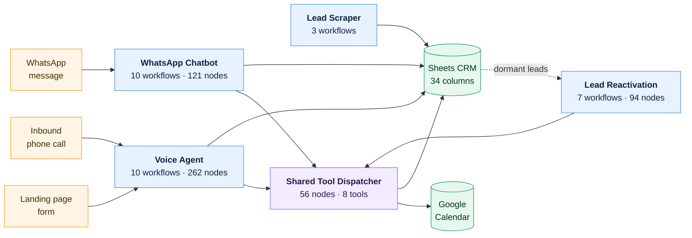

# Production n8n Automation Systems

Five interconnected automation systems for UK home-service businesses, built on n8n with Claude,
VAPI, Twilio, Google Workspace and Apify. **41 workflows, 616 nodes, ~7,500 lines of JavaScript**,
exported from a live instance and documented here.

Every diagram below is generated from the workflow's own canvas coordinates. Nothing is redrawn,
idealised, or mocked up.



Three systems share one booking dispatcher. That decision removed three copies of calendar logic —
and concentrated the blast radius, which is the story below.

---

## The systems

| System | Workflows | Nodes | What it does |
|---|---:|---:|---|
| [**AI Voice Agent**](systems/01-voice-agent.md) | 10 | 262 | Answers inbound calls 24/7, calls new leads within minutes, books into Google Calendar, recovers missed calls, sends reminders |
| [**WhatsApp Chatbot**](systems/02-whatsapp-chatbot.md) | 10 | 121 | Claude-powered receptionist with session memory and seven tool workflows — books, reschedules, cancels inside the chat |
| [**Lead Reactivation**](systems/03-lead-reactivation.md) | 7 | 94 | Scans a dormant lead database and runs AI voice re-engagement campaigns with cadence control |
| [**Lead Scraper v4**](systems/04-lead-scraper.md) | 3 (+10 utils) | 58 | Parent/child batch pipeline: scrape, enrich, score, route into a 34-column CRM |
| [**AI Ad Engine**](systems/05-ad-engine.md) | 1 | 38 | Weekly batch generating ad copy and image prompts into a human review queue |

---

## The part worth reading

Across eight months, **17 audit passes** logged **111 defects**.

**Static validation caught zero of them.**

Not a criticism of the validator — it does what it claims. It confirms nodes exist, parameters are
present, connections resolve, expressions parse. Here is what that misses.

### The defect that killed booking across three systems

Five nodes referenced the config node like this:

```javascript
// What was actually stored in five nodes — an escaped literal, 22 characters:
$('\\u2699\\ufe0f Client Config')

// What n8n needed, to match the node by name:
$('⚙️ Client Config')
```

n8n matches node names by exact string, so all five threw on **every execution**. Four were the
Google Calendar nodes — check availability, book, reschedule, cancel. Because that dispatcher is
shared by the voice agent, the inbound caller and the reactivation engine, **booking was dead
product-wide.**

The strict validator reported **0 errors and passed all 115 expressions** — correctly. `$('anything')`
is valid syntax. It surfaced only because the validator quoted the raw string inside a warning that
had been dismissed as a false positive for three days.

Probable cause: an API call that passed a double-escaped `"\\u2699"`. The standing rule that came out
of it: **after any write of an expression containing a node name, read it back. An API `success`
response describes the request, not the stored value.**

### Eight more like it

| | Defect | Consequence |
|---|---|---|
| 1 | `setHours()` on a UTC server | Every booking **one hour late for an entire summer** (BST) |
| 2 | Column named `Cancelled At` vs live `CancelledAt` | Every cancellation timestamp silently discarded |
| 3 | Unconditional success in 5 response builders | Voice agent **told callers they were opted out** before the write was verified |
| 4 | Strict `typeValidation` on 3 calendar-failure gates | Error branches unreachable — defensive code that never ran |
| 5 | Config Set nodes missing `includeOtherFields` | Trigger payload silently dropped; bookings built from empty data |
| 6 | Client-side row allocation on Sheets append | Simultaneous bookings collided; the fix exposed *hollow rows* — worse, because they look real |
| 7 | Session state read/written across a 5–16s window | Three messages 1s apart lost the first two — the standard "hi / how are you / question" opening |
| 8 | Twilio's 1,600-char cap | Long replies rejected outright — customer received **nothing**, not a truncation |

Full breakdown, nine classes with root causes: **[`engineering/bug-taxonomy.md`](engineering/bug-taxonomy.md)**

### And the one found while building this repository

Sanitizing the exports for publication turned up **two live API keys hardcoded in plaintext** inside
the Ad Engine's config node — an OpenAI project key and a Perplexity key. They would have been
published verbatim. It is documented in [`systems/05-ad-engine.md`](systems/05-ad-engine.md) rather
than quietly cleaned up, because it is the argument for the sanitization pass.

---

## What the workflows actually look like

The diagrams render each workflow's real layout, including the sticky notes carrying its design
documentation:


*`handle_dnc` — the GDPR/PECR opt-out tool. Its on-canvas note records every CRM field it writes and
why, sitting beside the nodes that write them.*

---

## Engineering documentation

| | |
|---|---|
| [**Bug taxonomy**](engineering/bug-taxonomy.md) | 111 defects, 9 classes, root causes, and why each was invisible to validation |
| [**Audit methodology**](engineering/audit-methodology.md) | 17 passes ranked by what each class actually caught — and what I'd change |
| [**Build standards**](engineering/build-standards.md) | Every convention enforced across 41 workflows, each traced to the defect that caused it |
| [**How Claude was used**](engineering/how-claude-was-used.md) | Claude Code + n8n MCP as the build environment, including where it failed |

---

## Start here

- **Two minutes** — this page, then the [voice agent](systems/01-voice-agent.md) architecture diagram
- **Ten minutes** — [`bug-taxonomy.md`](engineering/bug-taxonomy.md), which is where the engineering is
- **Hands on** — import any export from [`workflows/`](workflows/); credentials are stubbed, structure is intact

---

## Business context

Built for UK home-service installers — solar, HVAC, insulation, heating. Per ONS, **94.8% of firms
in this market have fewer than 10 employees**: there is no operations team, so the owner answers the
phone between jobs and quotes get followed up in the evening or not at all.

The target is not lead volume. UK installers are largely demand-constrained, and the real bottleneck
is the owner's admin time. These systems target **response latency and follow-up consistency** —
converting demand that already exists. One architectural commitment runs through all of them: *a
captured lead gets an automated response in under two minutes, at any hour, with no human involved.*

Client names, pricing and commercial terms are excluded. All credentials appear as `CREDENTIAL_ID`,
account identifiers as `YOUR_*`, and keys as `*_REDACTED`.

**Stack** — n8n · Claude (Anthropic API) · VAPI · Twilio · Google Sheets & Calendar · Supabase · Apify
