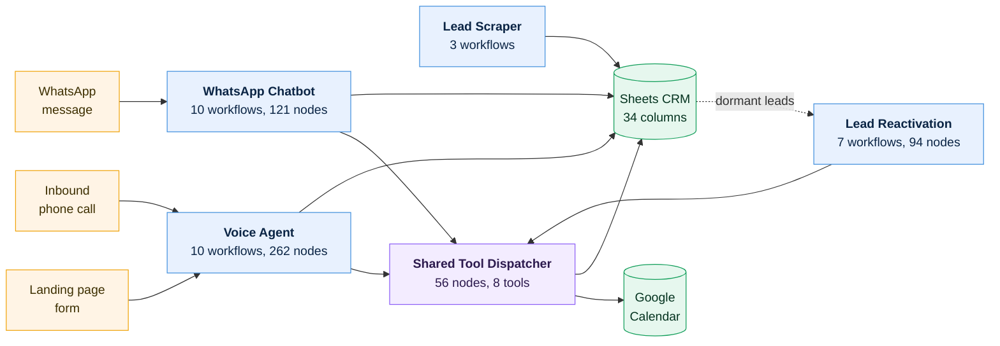
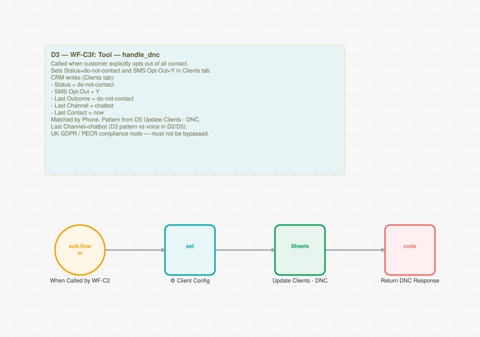

# Production n8n Automation Systems

Four connected automation systems I built for UK home-service businesses, running on n8n with
Claude, VAPI, Twilio, Google Workspace and Apify. **40 workflows, 578 nodes, around 7,200 lines of
JavaScript**, exported from my live instance and documented here.

Every diagram is generated from the workflow's own canvas coordinates, so what you see is the real
layout rather than something I redrew.



Three of the systems share one booking dispatcher. That removed three copies of calendar logic, and
it concentrated the blast radius. Both halves of that decision show up below.

## The systems

| System | Workflows | Nodes | What it does |
|---|---:|---:|---|
| [**AI Voice Agent**](systems/01-voice-agent.md) | 10 | 262 | Answers inbound calls 24/7, rings new leads within minutes, books into Google Calendar, recovers missed calls, sends reminders |
| [**WhatsApp Chatbot**](systems/02-whatsapp-chatbot.md) | 10 | 121 | Claude-powered receptionist with session memory and seven tool workflows. Books, reschedules and cancels inside the chat |
| [**Lead Reactivation**](systems/03-lead-reactivation.md) | 7 | 94 | Scans a dormant lead database and runs AI voice re-engagement campaigns with cadence control |
| [**Lead Scraper v4**](systems/04-lead-scraper.md) | 3 (+10 utils) | 101 | Parent/child batch pipeline: scrape, enrich, score and route into a 34-column CRM |

## The part worth reading

Over eight months I ran 17 audit passes and logged 111 bugs.

**Static validation caught none of them.**

That is not a complaint about the validator. It does what it says: checks that nodes exist,
parameters are filled in, connections resolve and expressions parse. Here is what it leaves out.

### The bug that killed booking in three systems

Five nodes referenced my config node like this:

```javascript
// What was actually stored, an escaped literal, 22 characters:
$('\\u2699\\ufe0f Client Config')

// What n8n needed in order to match the node by name:
$('⚙️ Client Config')
```

n8n matches node names by exact string, so all five threw on every execution. Four of them were the
Google Calendar nodes: check availability, book, reschedule, cancel. Because that dispatcher is
shared by the voice agent, the inbound caller and the reactivation engine, booking was dead across
the whole product.

The strict validator reported 0 errors and passed all 115 expressions, correctly. `$('anything')` is
valid syntax. It only surfaced because the validator quoted the raw string inside a warning I had
been dismissing as a false positive for three days.

The likely cause was an API call passing a double-escaped `"\\u2699"`. The rule I took from it: after
writing any expression containing a node name, read it back. An API `success` response tells you
about the request, not about what got stored.

### Eight more

| Bug | What it did |
|---|---|
| `setHours()` on a UTC server | Put every booking an hour late for a whole summer (BST) |
| Column written as `Cancelled At`, live column is `CancelledAt` | Silently dropped every cancellation timestamp |
| Unconditional success in five response builders | Voice agent told callers they were opted out before the write was checked |
| Strict `typeValidation` on three calendar-failure gates | Made the error branches unreachable. Defensive code that never ran |
| Config Set nodes missing `includeOtherFields` | Dropped the trigger payload, so bookings were built from empty data |
| Client-side row allocation on Sheets append | Simultaneous bookings collided. My fix then exposed half-empty rows, which are worse because they look real |
| Session state read and written across a 5 to 16 second window | Three messages a second apart lost the first two, which is the normal way people open a chat |
| Twilio's 1,600 character cap | Long replies were rejected outright and the customer received nothing at all |

Full write-up, nine classes with root causes: **[`engineering/bug-taxonomy.md`](engineering/bug-taxonomy.md)**

### And one more while publishing this

I wrote a sanitizer to strip credentials out of these exports before publishing them. It passed its
own verification twice. Then GitHub's secret scanning blocked my first push over a Twilio Account
SID I had no pattern for.

That is the same lesson as everything above, found the same way: by something outside my own loop
checking the work. I fixed the sanitizer and rebuilt the history rather than clicking the "allow
this secret" button.

## What the workflows look like

Each diagram renders the real layout, including the sticky notes I keep on the canvas.



The `handle_dnc` opt-out tool. Its note lists every CRM field it writes and why, sitting next to the
nodes that write them.

## Engineering documentation

| | |
|---|---|
| [**Bug taxonomy**](engineering/bug-taxonomy.md) | 111 bugs, nine classes, root causes, and why each one was invisible to validation |
| [**Audit methodology**](engineering/audit-methodology.md) | 17 passes ranked by what each kind actually caught, and what I would do differently |
| [**Build standards**](engineering/build-standards.md) | Every convention I use across the 40 workflows, each traced back to the bug that caused it |
| [**How Claude was used**](engineering/how-claude-was-used.md) | Claude Code and an n8n MCP server as my build environment, including where it failed |

## Start here

- **Two minutes:** this page, then the [voice agent](systems/01-voice-agent.md) architecture diagram.
- **Ten minutes:** [`bug-taxonomy.md`](engineering/bug-taxonomy.md), which is where the engineering is.
- **Hands on:** import any export from [`workflows/`](workflows/). Credentials are stubbed, structure is intact.

## Why I built these

These are for UK home-service installers: solar, HVAC, insulation, heating. Per ONS, 94.8% of firms
in this market have fewer than ten employees. There is no operations team, so the owner answers the
phone between jobs and quotes get chased in the evening or not at all.

I am not trying to generate more leads. UK installers are mostly demand-constrained, and the real
bottleneck is the owner's admin time. These systems go after response speed and follow-up
consistency instead, which is what converts the demand already there. One commitment runs through
all of them: a captured lead gets an automated response in under two minutes, at any hour, with
nobody involved.

I have left client names, pricing and commercial terms out. Credentials appear as `CREDENTIAL_ID`,
account identifiers as `YOUR_*`, keys as `*_REDACTED`.

**Stack:** n8n, Claude (Anthropic API), VAPI, Twilio, Google Sheets and Calendar, Supabase, Apify
