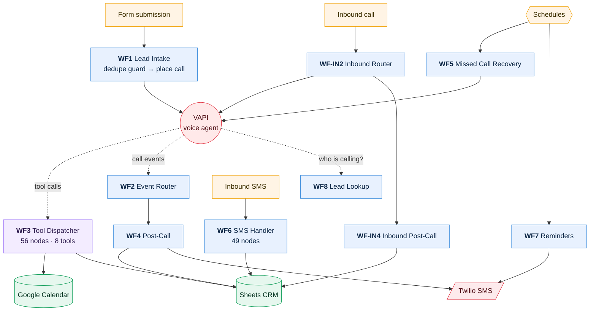

# AI Voice Agent — Inbound + Outbound Calling

**10 workflows · 262 nodes · ~1542 lines of JavaScript**

An AI phone agent that answers every inbound call 24/7 and calls new leads back within minutes of a form submission. VAPI handles speech; **n8n owns every business decision** — qualification, calendar availability, booking, SMS follow-up, missed-call recovery and reminders.

The constraint that shaped the architecture: a form submitted at 11pm gets a call, and a caller at 3am gets a real conversation. No human in the loop for routine operations.

---

## How it fits together



**Read it as three loops.** A *call loop* (WF1 or WF-IN2 → VAPI → WF3 for tools → WF2/WF-IN2 for events → WF4/WF-IN4 to record the outcome), a *recovery loop* on a schedule (WF5 retries the unreachable, WF7 reminds the booked), and a *reply loop* for anything the customer sends back by text (WF6).

The dotted edges are the interesting ones: they are live HTTP calls *made during a phone conversation*, while a human waits on the line. That latency budget is what makes WF3 the most constrained workflow in the project.

---

## The workflows

| # | Workflow | Nodes | Trigger | Does |
|---|---|---:|---|---|
| 1 | [WF1 · Lead Intake & Outbound Trigger](#wf1--lead-intake--outbound-trigger) | 22 | `POST /lead-intake` · authenticated | Receives a form lead and places the call |
| 2 | [WF2 · VAPI Event Router](#wf2--vapi-event-router) | 9 | `POST /vapi-events` · authenticated | Routes call lifecycle events |
| 3 | [WF3 · Tool Dispatcher](#wf3--tool-dispatcher) | 56 | Called by another workflow | Serves all 8 voice-agent tools · shared by 3 systems |
| 4 | [WF4 · Post-Call Processing](#wf4--post-call-processing) | 26 | Called by another workflow | Parses the outcome, updates CRM, sends follow-up |
| 5 | [WF5 · Missed Call Recovery](#wf5--missed-call-recovery) | 28 | Scheduled (cron) | Retries unreachable leads on a cadence |
| 6 | [WF6 · Inbound SMS Handler](#wf6--inbound-sms-handler) | 49 | `POST /wf6-sms-inbound` · authenticated | Classifies and acts on replies by text |
| 7 | [WF7 · Appointment Reminders](#wf7--appointment-reminders) | 20 | Scheduled (cron) | Scheduled reminders, shared with reactivation |
| 8 | [WF8 · Inbound Lead Lookup](#wf8--inbound-lead-lookup) | 7 | Called by another workflow | Tells the agent who is calling, mid-call |
| 9 | [WF-IN2 · Inbound Event Router](#wf-in2--inbound-event-router) | 12 | `POST /vapi-inbound` · authenticated | WF2's equivalent for inbound calls |
| 10 | [WF-IN4 · Inbound Post-Call Processing](#wf-in4--inbound-post-call-processing) | 33 | Called by another workflow | WF4's equivalent for inbound calls |

---

### WF1 · Lead Intake & Outbound Trigger

The front door for outbound. A form submission arrives, gets normalised, and is checked against the CRM for a duplicate before anything happens — without that guard, a customer who submits twice gets called twice. Out-of-hours submissions are queued rather than dialled, and picked up by WF5's next scheduled sweep instead.

If VAPI rejects the call, a dedicated failure branch records why. That branch matters more than it looks: a call that never connects and is recorded as connected is a lead that silently disappears.


**22 nodes** — 5× `if` · 5× `respondToWebhook` · 4× `googleSheets` · 3× `code` · 2× `twilio` · 1× `webhook`  
**Trigger** — `POST /lead-intake` · authenticated  
**Code** — 38 lines of ES5 JavaScript  
**Export** — [`wf01-lead-intake.json`](../workflows/01-voice-agent/wf01-lead-intake.json)

> This webhook was **publicly unauthenticated** until a late security pass. It places real phone calls — anyone with the URL could make the system dial arbitrary numbers on the client's account and caller ID. Now header-authenticated. See [Class 9](../engineering/bug-taxonomy.md).


### WF2 · VAPI Event Router

A deliberately thin router. VAPI emits events across a call's lifecycle — started, ended, failed — and this workflow's only job is to identify which one arrived and hand it to the right processor. Keeping it thin means the routing logic stays readable and the processing logic stays testable in isolation.


**9 nodes** — 3× `respondToWebhook` · 2× `executeWorkflow` · 1× `webhook` · 1× `set` · 1× `switch` · 1× `code`  
**Trigger** — `POST /vapi-events` · authenticated  
**Code** — 32 lines of ES5 JavaScript  
**Export** — [`wf02-vapi-event-router.json`](../workflows/01-voice-agent/wf02-vapi-event-router.json)

<details><summary>Its on-canvas documentation</summary>

```
## WF2 — VAPI Event Router

Single webhook URL given to VAPI. Receives ALL events and routes them.

**Routing:**
- `tool-calls` → WF3 Tool Dispatcher (synchronous — waits for response)
- `end-of-call-report` → WF4 Post-Call Processor (async — fire and forget)
- Everything else → 200 OK, ignored

**Setup:**
1. Activate this workflow
2. Copy the Production webhook URL from the Webhook node
3. Paste it into VAPI assistant → Server URL

**Upstream:** VAPI (all events)
**Downstream:** WF3 (tool calls), WF4 (post-call)
```
</details>


### WF3 · Tool Dispatcher

The most important workflow in the repository, and the most constrained. Every tool the voice agent can call routes through here: check availability, book, reschedule, cancel, look up a customer, log a message, handle an opt-out.

It is **shared by three separate systems** — the outbound agent, the inbound agent, and the lead reactivation engine all book through this one dispatcher rather than each carrying its own calendar logic. One implementation of "is this slot free," one of "write the appointment," one of "cancel it."

Everything here runs while a human is waiting on the phone, so every branch must return a speakable string — never a raw error, never a stack trace, never silence.


**56 nodes** — 15× `code` · 12× `set` · 11× `googleSheets` · 7× `if` · 4× `googleCalendar` · 4× `httpRequest`  
**Trigger** — Called by another workflow  
**Code** — 637 lines of ES5 JavaScript  
**Export** — [`wf03-tool-dispatcher.json`](../workflows/01-voice-agent/wf03-tool-dispatcher.json)

> Sharing cuts both ways. A single reference-integrity defect here — five nodes storing the config node's name as an escaped literal — killed booking across **all three systems at once**, while the strict validator reported 0 errors. It is the best example in the project of why structural validity is not correctness: [Class 8](../engineering/bug-taxonomy.md).

<details><summary>Its on-canvas documentation</summary>

```
## WF3 — Tool Dispatcher

Called by WF2 on every VAPI `tool-calls` event.
Must respond within 5 seconds.

**10 Tools:**
1. lookupCaller → Sheets Clients lookup
2. checkAvailability → Calendar free/busy slots
3. bookAppointment → Calendar create + Appointment Log
4. rescheduleAppointment → Calendar update + Appointment Log
5. cancelAppointment → Calendar delete + Appointment Log
6. getBusinessInfo → Static info (hours, pricing, subsidies)
7. takeMessage → Messages tab append
8. scheduleCallback → Clients tab callback time
9. markDoNotContact → Clients tab DNC flag
10. createLead → Clients tab new row for unknown callers

**Credentials:** Google Sheets OAuth2 + Google Calendar OAuth2
**Sheet tabs:** Clients | Appointment Log | Messages
```
</details>


### WF4 · Post-Call Processing

Where a finished call becomes structured data. VAPI returns a structured summary of what happened; this workflow parses it into an outcome — booked, not interested, opted out, voicemail — writes the result to the CRM, and sends the appropriate follow-up SMS.

The outcome schema is deliberately *not* unified between the inbound and outbound assistants. Each matches the parser that consumes it, and unifying the field names without changing both parsers would silently break outcome recording.


**26 nodes** — 8× `twilio` · 4× `googleSheets` · 4× `if` · 3× `code` · 2× `httpRequest` · 1× `executeWorkflowTrigger`  
**Trigger** — Called by another workflow  
**Code** — 290 lines of ES5 JavaScript  
**Export** — [`wf04-post-call-processing.json`](../workflows/01-voice-agent/wf04-post-call-processing.json)

<details><summary>Its on-canvas documentation</summary>

```
## WF4 — Post-Call Processing

Triggered async by WF2 after every VAPI call ends.
No response required — fire and forget.

**Flow:**
1. Parse VAPI end-of-call-report payload
2. ✅ Validate: halt if no phone number extracted
3. Read Clients tab by phone number
4. Read Appointment Log for confirmed booking
5. Read Messages for any urgent notes
6. Build update payload (CRM + SMS + activity log fields)
7a. Write Activity Log (parallel) — audit trail for every call
7b. Update Clients tab in Google Sheets
8a. If urgent message → SMS alert to business owner
8b. Route by outcome → SMS to caller

**Upstream:** WF2 (fires this on end-of-call-report event)
**Downstream:** None — end of chain
**Sheets:** Reads Clients + Appointment Log + Messages. Writes Clients + Activity Log.

⚠️ Before activating:
- Replace PLACEHOLDER_TWILIO_NUMBER in Client Config
- Replace PLACEHOLDER_OWNER_PHONE in Client Config
- Add Twilio credentials to the 4 Twilio SMS nodes
- Create Activity Log tab in Google Sheets:
  Columns: Timestamp | Phone | Call ID | Outcome | Duration (s) | SMS Queued | Config Ready | Error Notes
```
</details>


### WF5 · Missed Call Recovery

Runs on a schedule and re-attempts leads that were never reached, with attempt-count-aware cadence so a lead is followed up persistently but not harassed. It also picks up the out-of-hours leads WF1 queued rather than dialling at midnight — the two workflows form a single loop that is easy to mistake for a dead end when reading WF1 alone.


**28 nodes** — 8× `googleSheets` · 7× `twilio` · 5× `if` · 4× `httpRequest` · 1× `scheduleTrigger` · 1× `set`  
**Trigger** — Scheduled (cron)  
**Code** — 47 lines of ES5 JavaScript  
**Export** — [`wf05-missed-call-recovery.json`](../workflows/01-voice-agent/wf05-missed-call-recovery.json)

<details><summary>Its on-canvas documentation</summary>

```
## WF5 — Missed Call Recovery

Polls every 30 min. Finds leads that did not answer and works them through the retry sequence.

**Sequence logic:**
- Step 0 + no-answer/voicemail: wait 30 min, then Call #2
- Step 1 + sequence-active: wait 4h, then SMS Follow-up
- Step 2 + sequence-active: wait 24h, then Call #3
- Step 3 + sequence-active: wait 2h grace, then Mark Unresponsive

**Callback branch:** Fires VAPI when Callback Time is reached.
**Business hours:** Calls and SMS only fire 08:00-20:59 London time.
**Error alerts:** Owner SMS alert if VAPI call fails to queue.

Activate AFTER WF3, WF4, WF2, WF1 are active.
```
</details>


### WF6 · Inbound SMS Handler

49 nodes of intent routing. A customer replying by text may be confirming an appointment, cancelling one, asking a question, or opting out — and the correct action differs completely for each. The workflow classifies the message, then executes the matching branch, including calendar changes and CRM updates.

Opt-out is the branch that gets the most defensive treatment: under UK PECR it is a legal obligation, not a preference, and an opt-out that is confirmed to the customer but not actually written is a compliance failure.


**49 nodes** — 17× `twilio` · 11× `googleSheets` · 11× `if` · 3× `code` · 3× `httpRequest` · 1× `webhook`  
**Trigger** — `POST /wf6-sms-inbound` · authenticated  
**Code** — 94 lines of ES5 JavaScript  
**Export** — [`wf06-inbound-sms-handler.json`](../workflows/01-voice-agent/wf06-inbound-sms-handler.json)

> Five phantom-success sites were found and closed here — branches that told the customer an action had succeeded without checking whether it had. Two were the opt-out and do-not-contact paths.

<details><summary>Its on-canvas documentation</summary>

```
## WF6 — Inbound SMS Handler

Handles all inbound SMS replies on the Twilio business number.

**Flow:** Twilio webhook → normalize phone → read lead → log SMS → classify intent (Claude AI) → act

**Actions by intent:**
- **opt-out** (STOP/UNSUBSCRIBE): Status=do-not-contact, SMS Opt-Out=Y + confirmation SMS
- **do-not-contact**: Status=do-not-contact + reply SMS
- **callback**: Status=callback-scheduled + Callback Time ISO
- **positive**: Status=callback-requested + reply SMS + alert owner
- **confirm** (BEVESTIG): Null-check → Updates ConfirmedAt + reply SMS (or 'no appt found' reply)
- **cancel** (ANNULEER): Null-check → Cancels appointment + Clients Status=callback-requested + reply SMS (or 'no appt found' reply)
- **unknown intent**: Alert owner
- **unknown number**: Alert owner

**Trigger:** POST /webhook/wf6-sms-inbound
```
</details>


### WF7 · Appointment Reminders

Scans upcoming appointments on a schedule and sends reminders. It serves bookings from the voice agent *and* from the reactivation system transparently, because both write to the same appointment log in the same shape — a small payoff from committing to one canonical schema across systems.

A failed reminder is retried rather than marked sent. That sounds obvious; the original implementation marked it sent regardless, so any reminder that failed was never retried and the customer simply didn't get one.


**20 nodes** — 4× `set` · 4× `googleSheets` · 4× `twilio` · 3× `if` · 1× `scheduleTrigger` · 1× `code`  
**Trigger** — Scheduled (cron)  
**Code** — 38 lines of ES5 JavaScript  
**Export** — [`wf07-appointment-reminders.json`](../workflows/01-voice-agent/wf07-appointment-reminders.json)

<details><summary>Its on-canvas documentation</summary>

```
## WF7 — Appointment Reminders

Runs every 30 minutes. Reads Appointment Log + Clients.
Sends SMS reminders to clients with upcoming appointments.

**Reminder sequence:**
- R1: 24h before (22–26h window) — day-before reminder
- R2: 2h before (1–3h window) — same-day reminder

**Duplicate protection:** Reminder1Sent / Reminder2Sent stamps
**SMS opt-out:** Cross-referenced from Clients tab
**Failure isolation:** Split in Batches(1) — one failed SMS never kills others
**Error alert:** Failed sends notify owner via SMS

**New Appointment Log columns required:**
AppointmentTimeISO | Reminder1Sent | Reminder2Sent | ConfirmedAt | CancelledAt

**CONFIRM/CANCEL replies:** Handled by WF6 (new intent branches)

**Credentials:** Google Sheets OAuth2 + Twilio
```
</details>


### WF8 · Inbound Lead Lookup

Called by the assistant at the start of an inbound call to look up the caller in the CRM, so the agent can greet a known customer by name and skip questions it already has answers to. It returns the last channel used, which lets the agent reference a previous WhatsApp or SMS conversation — the seam where the voice and messaging systems meet.


**7 nodes** — 3× `code` · 1× `executeWorkflowTrigger` · 1× `set` · 1× `if` · 1× `googleSheets`  
**Trigger** — Called by another workflow  
**Code** — 53 lines of ES5 JavaScript  
**Export** — [`wf08-inbound-lead-lookup.json`](../workflows/01-voice-agent/wf08-inbound-lead-lookup.json)

<details><summary>Its on-canvas documentation</summary>

```
## WF8 — Inbound Lead Lookup

Called SYNCHRONOUSLY by WF-IN2 on every `assistant-request` event.
Runs BEFORE the AI speaks — must complete in < 3 seconds.

**Flow:**
1. Extract phone from VAPI assistant-request payload
2. No phone (withheld number) → return empty variables
3. Lookup phone in Clients tab
4. Return { variables: {...} } with callerName, serviceInterest, isExistingLead, callCount, lastOutcome, upcomingAppointment, callerStatus

VAPI injects these into the AI system prompt before first speech.

**Upstream:** WF-IN2 (sync call on assistant-request)
**Downstream:** Returns { variables: {...} } to WF-IN2
**Sheets:** Reads Clients. NEVER writes.

⚠️ Constraint: must complete in < 3 seconds.
```
</details>


### WF-IN2 · Inbound Event Router

The inbound counterpart to WF2. Kept separate rather than merged because inbound and outbound calls differ in what is known at the start — an outbound call knows exactly who it is calling, an inbound call knows only a phone number — and merging them produced branching complexity worse than the duplication.


**12 nodes** — 4× `respondToWebhook` · 3× `executeWorkflow` · 2× `code` · 1× `webhook` · 1× `set` · 1× `switch`  
**Trigger** — `POST /vapi-inbound` · authenticated  
**Code** — 34 lines of ES5 JavaScript  
**Export** — [`wf-in2-inbound-event-router.json`](../workflows/01-voice-agent/wf-in2-inbound-event-router.json)

<details><summary>Its on-canvas documentation</summary>

```
## WF-IN2 — Inbound VAPI Event Router

Single webhook URL for ALL inbound VAPI events.
Mirrors WF2 but adds assistant-request routing and calls WF8.

**Routing:**
- `assistant-request` → WF8 Lead Lookup (sync, < 3s) → return { variables: {...} }
- `tool-calls` → WF3 Tool Dispatcher (sync, < 5s) → return { results: [...] }
- `end-of-call-report` → WF-IN4 Post-Call (async, fire+forget) → 200 OK
- Everything else → 200 OK, ignored

**Setup:**
1. Activate this workflow
2. Copy Production webhook URL from the Webhook node
3. Paste into VAPI inbound assistant → Server URL

**Upstream:** VAPI (all inbound assistant events)
**Downstream:** WF8 (assistant-request), WF3 (tool-calls), WF-IN4 (end-of-call)
```
</details>


### WF-IN4 · Inbound Post-Call Processing

Records inbound call outcomes, tagging call direction so inbound and outbound performance can be told apart later. Same shape as WF4, different outcome schema, matching the inbound assistant's structured output.


**33 nodes** — 6× `googleSheets` · 6× `twilio` · 6× `httpRequest` · 5× `code` · 5× `if` · 1× `executeWorkflowTrigger`  
**Trigger** — Called by another workflow  
**Code** — 279 lines of ES5 JavaScript  
**Export** — [`wf-in4-inbound-post-call.json`](../workflows/01-voice-agent/wf-in4-inbound-post-call.json)

<details><summary>Its on-canvas documentation</summary>

```
## WF-IN4 — Inbound Post-Call Processing

Triggered ASYNC by WF-IN2 after every inbound call ends.
No time constraint — fire and forget.

**Flow:**
1. Parse VAPI end-of-call-report payload
2. Halt if no phone number
3. Short call (< 10s):
   - Known caller → update Last Contact + Call Count only
   - Unknown caller → Activity Log only (no Clients row)
4. Full call:
   - Read Clients + Appointment Log + Messages
   - Build update payload (outcome, name, email, service, SMS text)
   - Update Clients tab (appendOrUpdate by Phone — creates row if new caller)
   - Write Activity Log (always)
   - If urgent message → SMS alert to business owner
   - Route by outcome → SMS to caller (booked / callback-requested / callback-scheduled)

**Upstream:** WF-IN2 (async fire on end-of-call-report)
**Downstream:** None — end of chain
**Sheets:** Reads Clients + Appt Log + Messages. Writes Clients + Activity Log.

⚠️ Before activating: replace PLACEHOLDER_TWILIO_NUMBER and PLACEHOLDER_OWNER_PHONE in Client Config.
```
</details>


---

## Engineering notes

**One dispatcher, three consumers.** The single most consequential design decision here. It removed three copies of calendar logic and gave every booking path identical behaviour — and it concentrated risk, which showed up exactly once, catastrophically.

**Retry is deliberately disabled on call placement.** VAPI's `POST /call` is not idempotent: a retry places a *second real phone call* to a customer. This is the one place in the codebase where `retryOnFail: false` is correct, and it is documented at the node so a future consistency sweep doesn't helpfully "fix" it.

**Timezone is explicit everywhere.** The n8n instance runs UTC; the business runs Europe/London. A `setHours()` call in the booking path shifted **every appointment one hour late for an entire summer** before it was caught. Every date construction now applies an explicit BST offset. See [Class 2](../engineering/bug-taxonomy.md).

**All four webhooks are now authenticated.** They were not, for months. The worst was `/lead-intake` — an open endpoint that places outbound calls.

---

## Run it

Import any of the JSON exports from [`workflows/01-voice-agent/`](../workflows/01-voice-agent/). Credentials are stubbed as `CREDENTIAL_ID` and account identifiers as `YOUR_*` placeholders; re-map them after import.
