# AI Voice Agent (Inbound and Outbound Calling)

**10 workflows. 262 nodes. ~1542 lines of JavaScript.**

I built an AI phone agent that answers inbound calls around the clock and rings new leads back within minutes of a form submission. VAPI handles the speech. n8n makes every business decision: qualification, calendar availability, booking, SMS follow-up, missed-call recovery and reminders.

One constraint drove the architecture. A form submitted at 11pm still gets a call, and someone who rings at 3am still gets a real conversation. I wanted nothing routine waiting on a human.

---

## How it fits together

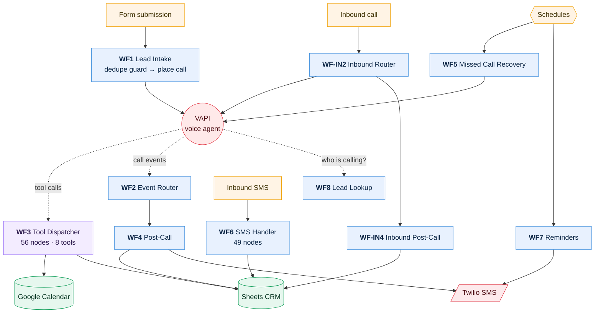

There are three loops here.

The **call loop** runs left to right. WF1 or WF-IN2 starts a call, VAPI talks to the customer, WF3 answers any tool requests mid-call, WF2 and WF-IN2 catch the lifecycle events, and WF4 or WF-IN4 records what happened.

The **recovery loop** runs on a schedule. WF5 retries leads nobody reached. WF7 reminds the ones who booked.

The **reply loop** is WF6, which handles anything the customer texts back.

The dotted edges are the ones I'd point at. Those are live HTTP calls made during a phone conversation, with a person waiting on the line. That latency budget is what makes WF3 the tightest workflow I built.

---

## The workflows

| # | Workflow | Nodes | Trigger | Does |
|---|---|---:|---|---|
| 1 | [WF1 · Lead Intake & Outbound Trigger](#wf1--lead-intake--outbound-trigger) | 22 | `POST /lead-intake`, authenticated | Receives a form lead and places the call |
| 2 | [WF2 · VAPI Event Router](#wf2--vapi-event-router) | 9 | `POST /vapi-events`, authenticated | Routes call lifecycle events |
| 3 | [WF3 · Tool Dispatcher](#wf3--tool-dispatcher) | 56 | Called by another workflow | Serves all 8 voice-agent tools · shared by 3 systems |
| 4 | [WF4 · Post-Call Processing](#wf4--post-call-processing) | 26 | Called by another workflow | Parses the outcome, updates CRM, sends follow-up |
| 5 | [WF5 · Missed Call Recovery](#wf5--missed-call-recovery) | 28 | Scheduled (cron) | Retries unreachable leads on a cadence |
| 6 | [WF6 · Inbound SMS Handler](#wf6--inbound-sms-handler) | 49 | `POST /wf6-sms-inbound`, authenticated | Classifies and acts on replies by text |
| 7 | [WF7 · Appointment Reminders](#wf7--appointment-reminders) | 20 | Scheduled (cron) | Scheduled reminders, shared with reactivation |
| 8 | [WF8 · Inbound Lead Lookup](#wf8--inbound-lead-lookup) | 7 | Called by another workflow | Tells the agent who is calling, mid-call |
| 9 | [WF-IN2 · Inbound Event Router](#wf-in2--inbound-event-router) | 12 | `POST /vapi-inbound`, authenticated | WF2's equivalent for inbound calls |
| 10 | [WF-IN4 · Inbound Post-Call Processing](#wf-in4--inbound-post-call-processing) | 33 | Called by another workflow | WF4's equivalent for inbound calls |

---

### WF1 · Lead Intake & Outbound Trigger

The front door for outbound calling. A form submission arrives, gets normalised, and is checked against the CRM before anything else happens. Without that duplicate guard, a customer who submits the form twice gets phoned twice.

Submissions outside business hours are queued rather than dialled, and WF5 picks them up on its next sweep. If VAPI refuses the call, a separate branch records why. I added that branch after realising a call that never connected but got logged as connected is a lead that quietly disappears.

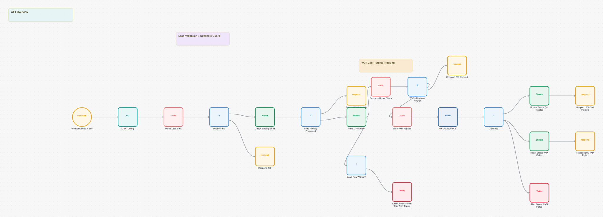

**22 nodes:** 5x `if`, 5x `respondToWebhook`, 4x `googleSheets`, 3x `code`, 2x `twilio`, 1x `webhook`  
**Trigger:** `POST /lead-intake`, authenticated  
**Code:** 38 lines of ES5 JavaScript  
**Export:** [`wf01-lead-intake.json`](../workflows/01-voice-agent/wf01-lead-intake.json)

> I left this webhook unauthenticated for months. It places real phone calls, so anyone with the URL could have made the system dial arbitrary numbers on the client's account and caller ID. It takes a header secret now. See [Class 9](../engineering/bug-taxonomy.md).


### WF2 · VAPI Event Router

Thin on purpose. VAPI fires events across a call's life (started, ended, failed) and this workflow only works out which one arrived and who should handle it. Keeping it thin means the routing stays readable and the processing stays testable on its own.

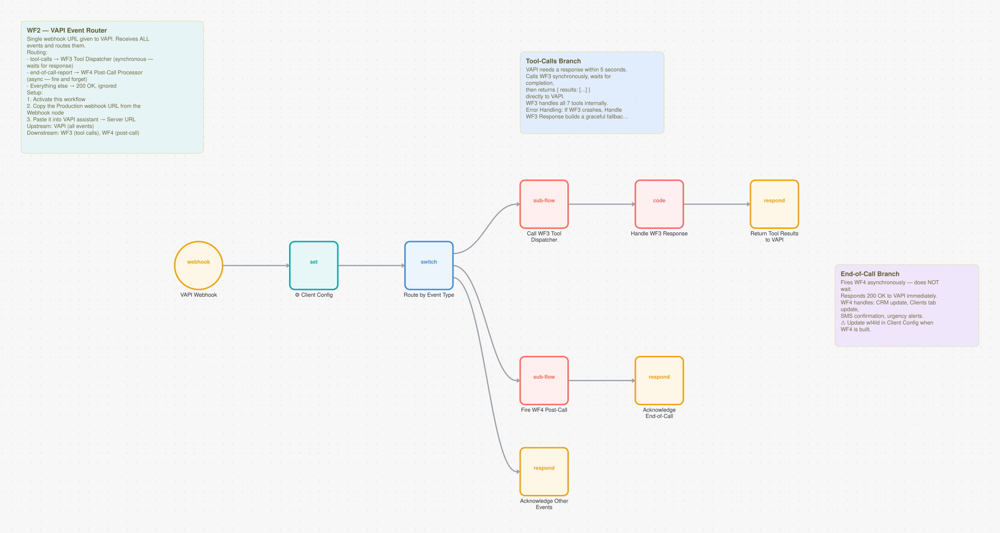

**9 nodes:** 3x `respondToWebhook`, 2x `executeWorkflow`, 1x `webhook`, 1x `set`, 1x `switch`, 1x `code`  
**Trigger:** `POST /vapi-events`, authenticated  
**Code:** 32 lines of ES5 JavaScript  
**Export:** [`wf02-vapi-event-router.json`](../workflows/01-voice-agent/wf02-vapi-event-router.json)

<details><summary>Its on-canvas documentation</summary>

```
## WF2 — VAPI Event Router

Single webhook URL given to VAPI. Receives ALL events and routes them.

**Routing:**
- `tool-calls` → WF3 Tool Dispatcher (synchronous — waits for response)
- `end-of-call-report` → WF4 Post-Call Processor (async — fire and forget)
- Everything else → 200 OK, ignored

**Setup:**
1. Activate this workflow
2. Copy the Production webhook URL from the Webhook node
3. Paste it into VAPI assistant → Server URL

**Upstream:** VAPI (all events)
**Downstream:** WF3 (tool calls), WF4 (post-call)
```
</details>


### WF3 · Tool Dispatcher

The most important workflow I built, and the most constrained. Every tool the voice agent can reach runs through it: check availability, book, reschedule, cancel, look up a customer, log a message, handle an opt-out.

Three systems share it. The outbound agent, the inbound agent and the reactivation engine all book through this one dispatcher instead of each carrying its own calendar code. One implementation of "is this slot free", one of "write the appointment", one of "cancel it".

All of it runs while someone waits on the phone, so every branch has to return a sentence the agent can say out loud. No raw errors, no stack traces, no silence.

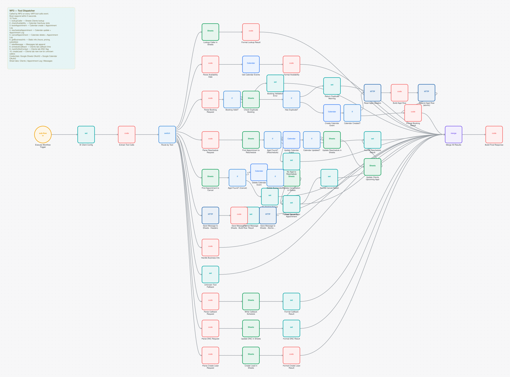

**56 nodes:** 15x `code`, 12x `set`, 11x `googleSheets`, 7x `if`, 4x `googleCalendar`, 4x `httpRequest`  
**Trigger:** Called by another workflow  
**Code:** 637 lines of ES5 JavaScript  
**Export:** [`wf03-tool-dispatcher.json`](../workflows/01-voice-agent/wf03-tool-dispatcher.json)

> Sharing cuts both ways. One reference bug in here, five nodes storing the config node's name as an escaped literal, killed booking in all three systems at once while the strict validator reported zero errors. It is the clearest case I have of valid structure hiding broken behaviour: [Class 8](../engineering/bug-taxonomy.md).

<details><summary>Its on-canvas documentation</summary>

```
## WF3 — Tool Dispatcher

Called by WF2 on every VAPI `tool-calls` event.
Must respond within 5 seconds.

**10 Tools:**
1. lookupCaller → Sheets Clients lookup
2. checkAvailability → Calendar free/busy slots
3. bookAppointment → Calendar create + Appointment Log
4. rescheduleAppointment → Calendar update + Appointment Log
5. cancelAppointment → Calendar delete + Appointment Log
6. getBusinessInfo → Static info (hours, pricing, subsidies)
7. takeMessage → Messages tab append
8. scheduleCallback → Clients tab callback time
9. markDoNotContact → Clients tab DNC flag
10. createLead → Clients tab new row for unknown callers

**Credentials:** Google Sheets OAuth2 + Google Calendar OAuth2
**Sheet tabs:** Clients | Appointment Log | Messages
```
</details>


### WF4 · Post-Call Processing

Where a finished call turns into data. VAPI returns a structured summary, and this reads it into an outcome (booked, not interested, opted out, voicemail), writes that to the CRM, and sends whatever follow-up SMS fits.

I deliberately did not share the outcome schema between the inbound and outbound assistants. Each matches the parser that reads it. Unifying the field names without changing both parsers would break outcome recording silently, so they stay separate and documented.

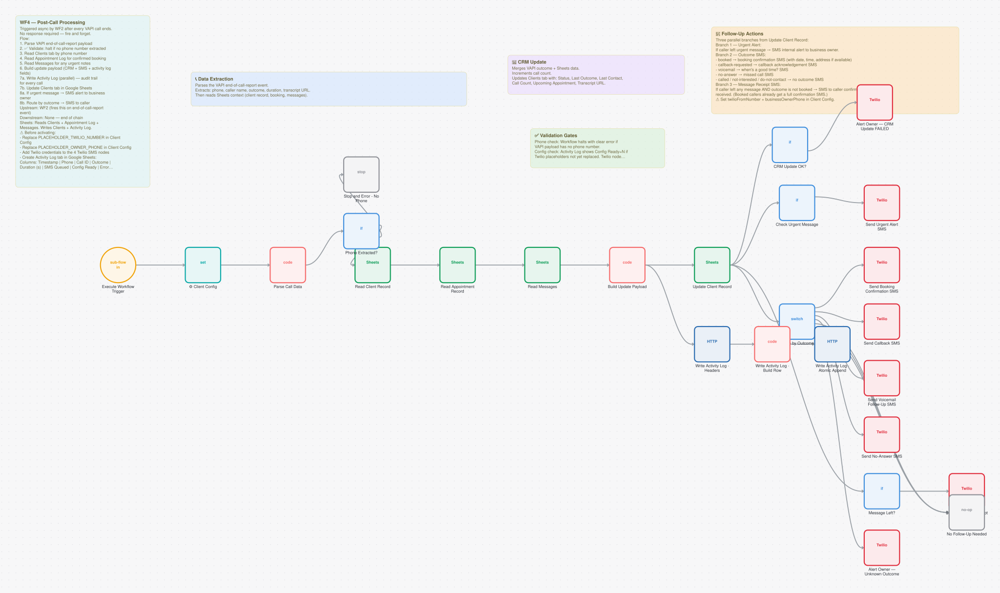

**26 nodes:** 8x `twilio`, 4x `googleSheets`, 4x `if`, 3x `code`, 2x `httpRequest`, 1x `executeWorkflowTrigger`  
**Trigger:** Called by another workflow  
**Code:** 290 lines of ES5 JavaScript  
**Export:** [`wf04-post-call-processing.json`](../workflows/01-voice-agent/wf04-post-call-processing.json)

<details><summary>Its on-canvas documentation</summary>

```
## WF4 — Post-Call Processing

Triggered async by WF2 after every VAPI call ends.
No response required — fire and forget.

**Flow:**
1. Parse VAPI end-of-call-report payload
2. ✅ Validate: halt if no phone number extracted
3. Read Clients tab by phone number
4. Read Appointment Log for confirmed booking
5. Read Messages for any urgent notes
6. Build update payload (CRM + SMS + activity log fields)
7a. Write Activity Log (parallel) — audit trail for every call
7b. Update Clients tab in Google Sheets
8a. If urgent message → SMS alert to business owner
8b. Route by outcome → SMS to caller

**Upstream:** WF2 (fires this on end-of-call-report event)
**Downstream:** None — end of chain
**Sheets:** Reads Clients + Appointment Log + Messages. Writes Clients + Activity Log.

⚠️ Before activating:
- Replace PLACEHOLDER_TWILIO_NUMBER in Client Config
- Replace PLACEHOLDER_OWNER_PHONE in Client Config
- Add Twilio credentials to the 4 Twilio SMS nodes
- Create Activity Log tab in Google Sheets:
  Columns: Timestamp | Phone | Call ID | Outcome | Duration (s) | SMS Queued | Config Ready | Error Notes
```
</details>


### WF5 · Missed Call Recovery

Runs on a schedule and retries leads nobody reached, using the attempt count to space things out so a lead gets chased properly without being harassed.

It also collects the out-of-hours leads WF1 parked rather than dialling at midnight. Reading WF1 on its own, that queue looks like a dead end. It isn't. The two workflows are one loop, and I have caught myself re-investigating it twice.

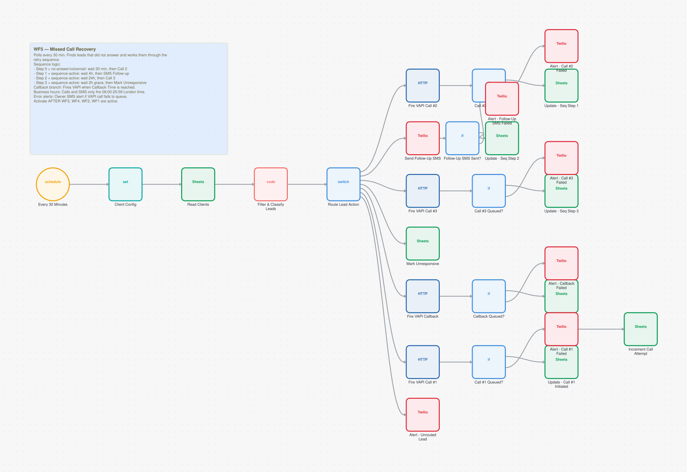

**28 nodes:** 8x `googleSheets`, 7x `twilio`, 5x `if`, 4x `httpRequest`, 1x `scheduleTrigger`, 1x `set`  
**Trigger:** Scheduled (cron)  
**Code:** 47 lines of ES5 JavaScript  
**Export:** [`wf05-missed-call-recovery.json`](../workflows/01-voice-agent/wf05-missed-call-recovery.json)

<details><summary>Its on-canvas documentation</summary>

```
## WF5 — Missed Call Recovery

Polls every 30 min. Finds leads that did not answer and works them through the retry sequence.

**Sequence logic:**
- Step 0 + no-answer/voicemail: wait 30 min, then Call #2
- Step 1 + sequence-active: wait 4h, then SMS Follow-up
- Step 2 + sequence-active: wait 24h, then Call #3
- Step 3 + sequence-active: wait 2h grace, then Mark Unresponsive

**Callback branch:** Fires VAPI when Callback Time is reached.
**Business hours:** Calls and SMS only fire 08:00-20:59 London time.
**Error alerts:** Owner SMS alert if VAPI call fails to queue.

Activate AFTER WF3, WF4, WF2, WF1 are active.
```
</details>


### WF6 · Inbound SMS Handler

Forty-nine nodes of intent routing. Someone texting back might be confirming an appointment, cancelling one, asking a question or opting out, and the right action is completely different for each. The workflow classifies the message, then runs the matching branch, including calendar changes and CRM updates.

Opt-out gets the most defensive treatment. Under UK PECR it is a legal obligation rather than a preference, and confirming an opt-out you never actually wrote is a compliance failure.

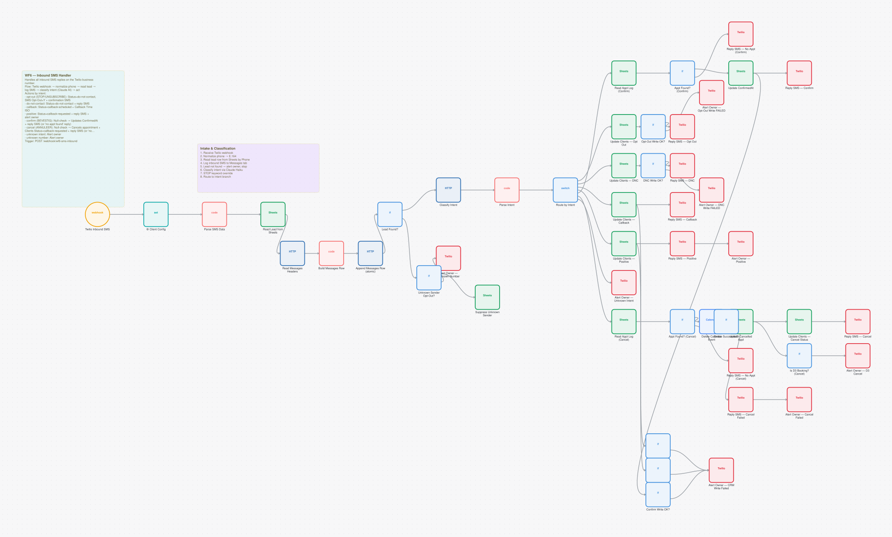

**49 nodes:** 17x `twilio`, 11x `googleSheets`, 11x `if`, 3x `code`, 3x `httpRequest`, 1x `webhook`  
**Trigger:** `POST /wf6-sms-inbound`, authenticated  
**Code:** 94 lines of ES5 JavaScript  
**Export:** [`wf06-inbound-sms-handler.json`](../workflows/01-voice-agent/wf06-inbound-sms-handler.json)

> I found five places here that told the customer an action had succeeded without checking whether it had. Two of them were the opt-out and do-not-contact paths.

<details><summary>Its on-canvas documentation</summary>

```
## WF6 — Inbound SMS Handler

Handles all inbound SMS replies on the Twilio business number.

**Flow:** Twilio webhook → normalize phone → read lead → log SMS → classify intent (Claude AI) → act

**Actions by intent:**
- **opt-out** (STOP/UNSUBSCRIBE): Status=do-not-contact, SMS Opt-Out=Y + confirmation SMS
- **do-not-contact**: Status=do-not-contact + reply SMS
- **callback**: Status=callback-scheduled + Callback Time ISO
- **positive**: Status=callback-requested + reply SMS + alert owner
- **confirm** (BEVESTIG): Null-check → Updates ConfirmedAt + reply SMS (or 'no appt found' reply)
- **cancel** (ANNULEER): Null-check → Cancels appointment + Clients Status=callback-requested + reply SMS (or 'no appt found' reply)
- **unknown intent**: Alert owner
- **unknown number**: Alert owner

**Trigger:** POST /webhook/wf6-sms-inbound
```
</details>


### WF7 · Appointment Reminders

Scans upcoming appointments on a schedule and sends reminders. It covers bookings from the voice agent and from the reactivation system without knowing the difference, because both write to the same appointment log in the same shape. That is the payoff from committing to one schema across systems.

A reminder that fails to send gets retried. Obvious in hindsight, but my first version marked it sent regardless, so any failed reminder was never retried and the customer never heard from us.

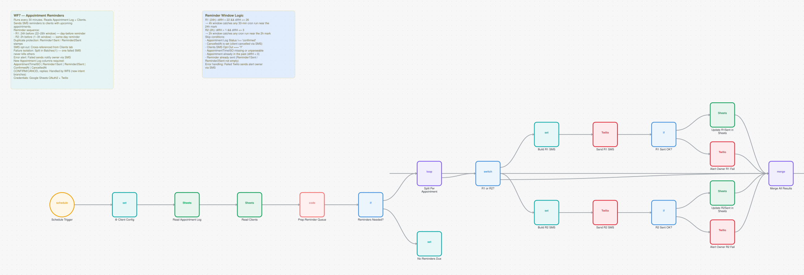

**20 nodes:** 4x `set`, 4x `googleSheets`, 4x `twilio`, 3x `if`, 1x `scheduleTrigger`, 1x `code`  
**Trigger:** Scheduled (cron)  
**Code:** 38 lines of ES5 JavaScript  
**Export:** [`wf07-appointment-reminders.json`](../workflows/01-voice-agent/wf07-appointment-reminders.json)

<details><summary>Its on-canvas documentation</summary>

```
## WF7 — Appointment Reminders

Runs every 30 minutes. Reads Appointment Log + Clients.
Sends SMS reminders to clients with upcoming appointments.

**Reminder sequence:**
- R1: 24h before (22–26h window) — day-before reminder
- R2: 2h before (1–3h window) — same-day reminder

**Duplicate protection:** Reminder1Sent / Reminder2Sent stamps
**SMS opt-out:** Cross-referenced from Clients tab
**Failure isolation:** Split in Batches(1) — one failed SMS never kills others
**Error alert:** Failed sends notify owner via SMS

**New Appointment Log columns required:**
AppointmentTimeISO | Reminder1Sent | Reminder2Sent | ConfirmedAt | CancelledAt

**CONFIRM/CANCEL replies:** Handled by WF6 (new intent branches)

**Credentials:** Google Sheets OAuth2 + Twilio
```
</details>


### WF8 · Inbound Lead Lookup

The assistant calls this at the start of an inbound call to find the caller in the CRM, so it can greet a known customer by name and skip questions it already has answers to. It also returns the last channel they used, which lets the agent refer back to an earlier WhatsApp or SMS thread. This is where my voice and messaging systems meet.

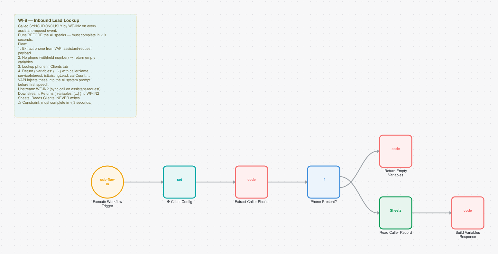

**7 nodes:** 3x `code`, 1x `executeWorkflowTrigger`, 1x `set`, 1x `if`, 1x `googleSheets`  
**Trigger:** Called by another workflow  
**Code:** 53 lines of ES5 JavaScript  
**Export:** [`wf08-inbound-lead-lookup.json`](../workflows/01-voice-agent/wf08-inbound-lead-lookup.json)

<details><summary>Its on-canvas documentation</summary>

```
## WF8 — Inbound Lead Lookup

Called SYNCHRONOUSLY by WF-IN2 on every `assistant-request` event.
Runs BEFORE the AI speaks — must complete in < 3 seconds.

**Flow:**
1. Extract phone from VAPI assistant-request payload
2. No phone (withheld number) → return empty variables
3. Lookup phone in Clients tab
4. Return { variables: {...} } with callerName, serviceInterest, isExistingLead, callCount, lastOutcome, upcomingAppointment, callerStatus

VAPI injects these into the AI system prompt before first speech.

**Upstream:** WF-IN2 (sync call on assistant-request)
**Downstream:** Returns { variables: {...} } to WF-IN2
**Sheets:** Reads Clients. NEVER writes.

⚠️ Constraint: must complete in < 3 seconds.
```
</details>


### WF-IN2 · Inbound Event Router

The inbound version of WF2. I kept it separate rather than merging because the two cases know different things at the start: an outbound call knows exactly who it is ringing, an inbound call only has a phone number. When I tried merging them the branching was harder to follow than the duplication.

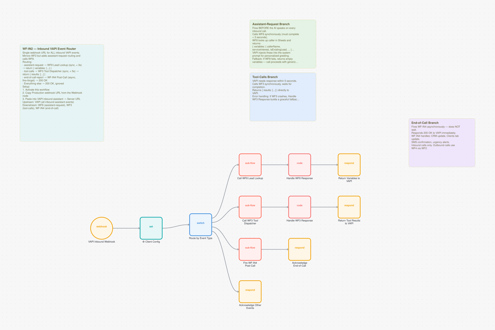

**12 nodes:** 4x `respondToWebhook`, 3x `executeWorkflow`, 2x `code`, 1x `webhook`, 1x `set`, 1x `switch`  
**Trigger:** `POST /vapi-inbound`, authenticated  
**Code:** 34 lines of ES5 JavaScript  
**Export:** [`wf-in2-inbound-event-router.json`](../workflows/01-voice-agent/wf-in2-inbound-event-router.json)

<details><summary>Its on-canvas documentation</summary>

```
## WF-IN2 — Inbound VAPI Event Router

Single webhook URL for ALL inbound VAPI events.
Mirrors WF2 but adds assistant-request routing and calls WF8.

**Routing:**
- `assistant-request` → WF8 Lead Lookup (sync, < 3s) → return { variables: {...} }
- `tool-calls` → WF3 Tool Dispatcher (sync, < 5s) → return { results: [...] }
- `end-of-call-report` → WF-IN4 Post-Call (async, fire+forget) → 200 OK
- Everything else → 200 OK, ignored

**Setup:**
1. Activate this workflow
2. Copy Production webhook URL from the Webhook node
3. Paste into VAPI inbound assistant → Server URL

**Upstream:** VAPI (all inbound assistant events)
**Downstream:** WF8 (assistant-request), WF3 (tool-calls), WF-IN4 (end-of-call)
```
</details>


### WF-IN4 · Inbound Post-Call Processing

Records inbound call outcomes and tags the call direction so I can separate inbound and outbound performance later. Same shape as WF4, different outcome schema, matching what the inbound assistant produces.

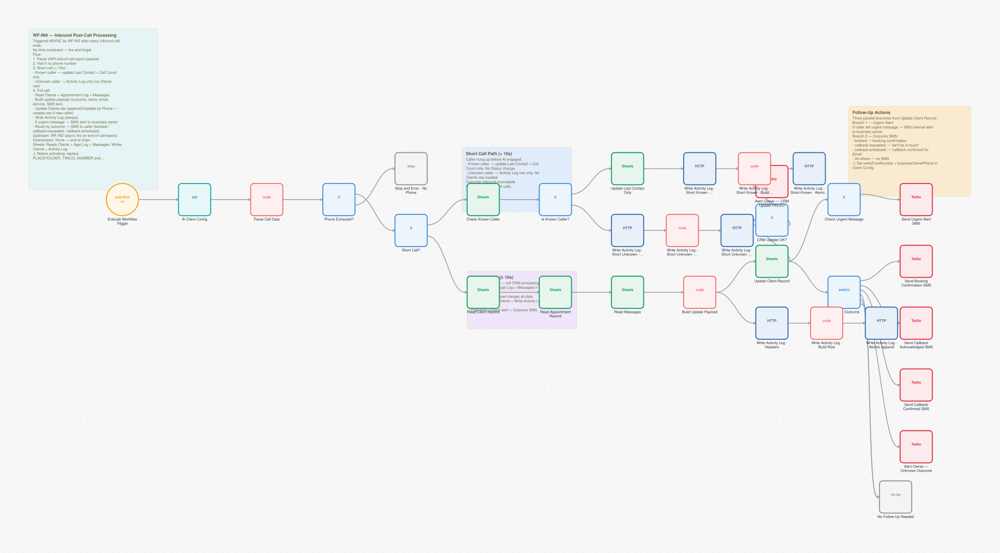

**33 nodes:** 6x `googleSheets`, 6x `twilio`, 6x `httpRequest`, 5x `code`, 5x `if`, 1x `executeWorkflowTrigger`  
**Trigger:** Called by another workflow  
**Code:** 279 lines of ES5 JavaScript  
**Export:** [`wf-in4-inbound-post-call.json`](../workflows/01-voice-agent/wf-in4-inbound-post-call.json)

<details><summary>Its on-canvas documentation</summary>

```
## WF-IN4 — Inbound Post-Call Processing

Triggered ASYNC by WF-IN2 after every inbound call ends.
No time constraint — fire and forget.

**Flow:**
1. Parse VAPI end-of-call-report payload
2. Halt if no phone number
3. Short call (< 10s):
   - Known caller → update Last Contact + Call Count only
   - Unknown caller → Activity Log only (no Clients row)
4. Full call:
   - Read Clients + Appointment Log + Messages
   - Build update payload (outcome, name, email, service, SMS text)
   - Update Clients tab (appendOrUpdate by Phone — creates row if new caller)
   - Write Activity Log (always)
   - If urgent message → SMS alert to business owner
   - Route by outcome → SMS to caller (booked / callback-requested / callback-scheduled)

**Upstream:** WF-IN2 (async fire on end-of-call-report)
**Downstream:** None — end of chain
**Sheets:** Reads Clients + Appt Log + Messages. Writes Clients + Activity Log.

⚠️ Before activating: replace PLACEHOLDER_TWILIO_NUMBER and PLACEHOLDER_OWNER_PHONE in Client Config.
```
</details>


---

## Engineering notes

**One dispatcher, three consumers.** My biggest design decision in this system. It removed three copies of calendar logic and gave every booking path identical behaviour. It also concentrated the risk, which showed up once and badly.

**I switched retry off on call placement on purpose.** VAPI's `POST /call` is not idempotent, so a retry means a second real phone call to the customer. It is the only place in the codebase where `retryOnFail: false` is correct, and I documented it at the node so a later consistency sweep doesn't helpfully turn it back on.

**Timezone handling is explicit everywhere.** The n8n instance runs on UTC and the business runs on Europe/London. A `setHours()` call in the booking path put every appointment an hour late for a whole summer before I noticed. Every date is now built with an explicit BST offset. See [Class 2](../engineering/bug-taxonomy.md).

**All four webhooks are authenticated now.** They weren't for months. The worst was `/lead-intake`, an open endpoint that places outbound calls.

---

## Run it

Import any of the JSON exports from [`workflows/01-voice-agent/`](../workflows/01-voice-agent/). Credentials are stubbed as `CREDENTIAL_ID` and account identifiers as `YOUR_*` placeholders, so you will need to re-map them after import.
