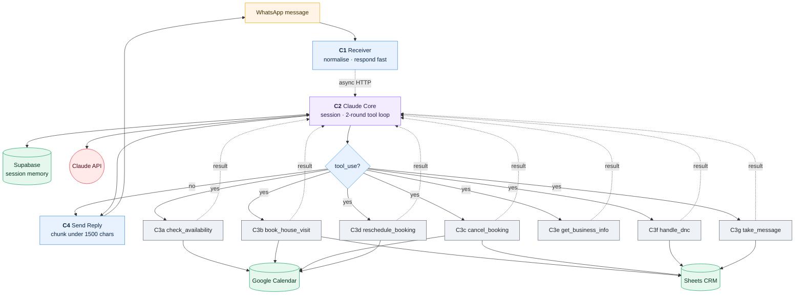
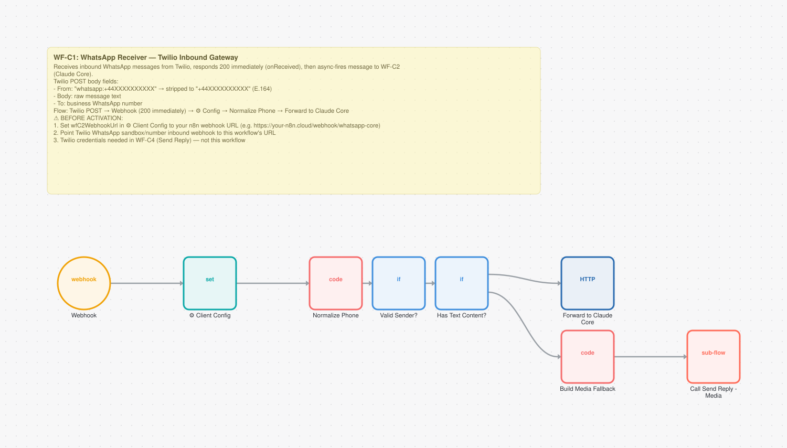
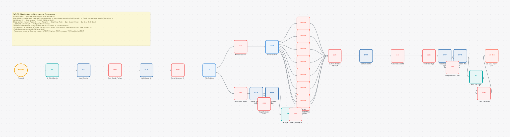
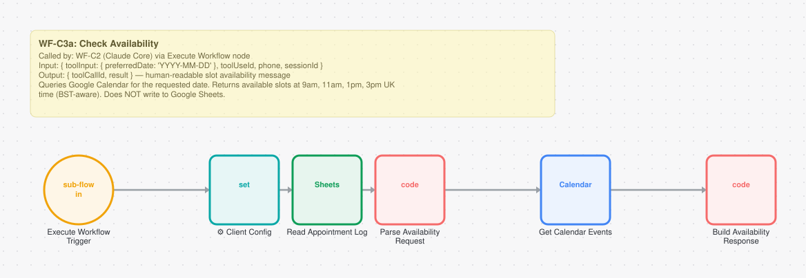
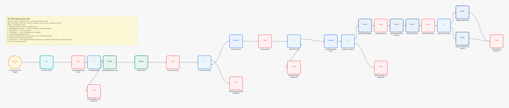
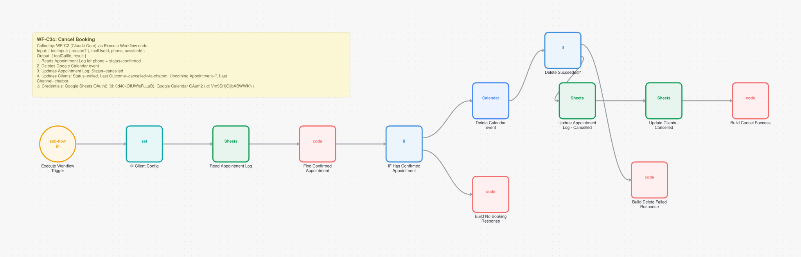
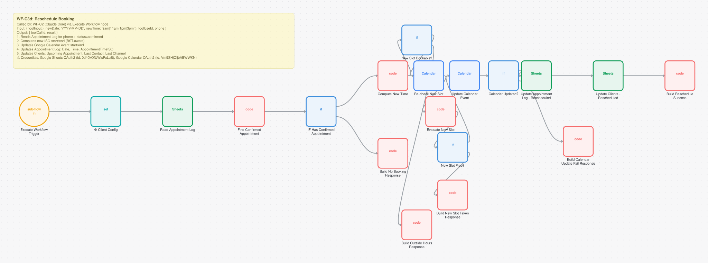
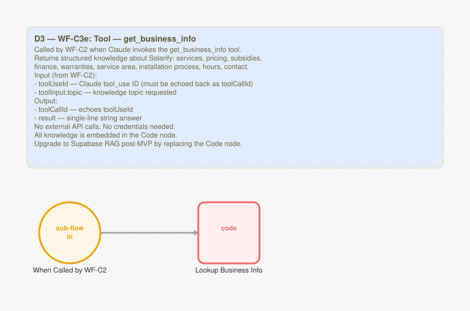
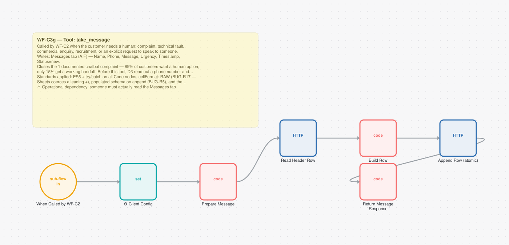
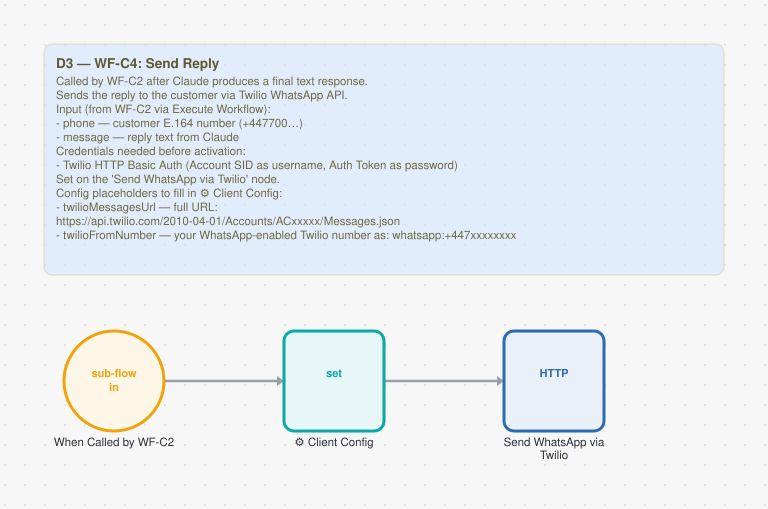

# AI Messaging Assistant (WhatsApp Chatbot)

**10 workflows. 121 nodes. ~1641 lines of JavaScript.**

A round-the-clock receptionist on WhatsApp, running on Claude with tool calling. It answers questions from a knowledge base, qualifies prospects, and books, reschedules or cancels house visits inside the conversation. No handoff, no form, no callback.

Session state lives in Supabase, so a conversation survives across messages, days and workflow restarts.

---

## How it fits together



The loop is the whole design. C1 accepts the message and replies to Twilio immediately so the webhook never times out. C2 loads the session, asks Claude, and either answers directly or calls one tool, feeds the result back, and asks Claude again. C4 sends whatever comes out.

Each of the seven tools is a separate workflow rather than a branch. That is what makes them testable and importable on their own, and it is a direct reaction to the first version, which put everything in one workflow, reached 75 nodes, and became impossible to work on.

---

## The workflows

| # | Workflow | Nodes | Trigger | Does |
|---|---|---:|---|---|
| 1 | [C1 · WhatsApp Receiver](#c1--whatsapp-receiver) | 8 | `POST /whatsapp-in`, **unauthenticated** | Accepts the message, responds instantly |
| 2 | [C2 · Claude Core](#c2--claude-core) | 34 | `POST /whatsapp-core`, authenticated | Session, Claude rounds 1 and 2, tool dispatch |
| 3 | [C3a · check_availability](#c3a--check_availability) | 6 | Called by another workflow | Finds free slots, BST-aware |
| 4 | [C3b · book_house_visit](#c3b--book_house_visit) | 26 | Called by another workflow | Books the visit and writes the lead atomically |
| 5 | [C3c · cancel_booking](#c3c--cancel_booking) | 12 | Called by another workflow | Cancels and clears the record |
| 6 | [C3d · reschedule_booking](#c3d--reschedule_booking) | 19 | Called by another workflow | Moves a booking, re-validating the new slot |
| 7 | [C3e · get_business_info](#c3e--get_business_info) | 2 | Called by another workflow | Knowledge-base fallback |
| 8 | [C3f · handle_dnc](#c3f--handle_dnc) | 4 | Called by another workflow | GDPR / PECR opt-out |
| 9 | [C3g · take_message](#c3g--take_message) | 7 | Called by another workflow | Escalates to the owner |
| 10 | [C4 · Send Reply](#c4--send-reply) | 3 | Called by another workflow | Sends the reply, chunked |

---

### C1 · WhatsApp Receiver

The entry point. It strips Twilio's `whatsapp:` prefix off the phone number, normalises the payload, fires an async HTTP call to C2 and returns straight away.

That async handoff is the whole reason it exists. Generating a reply takes 5 to 16 seconds and Twilio's webhook times out well before that.



**8 nodes:** 2x `code`, 2x `if`, 1x `webhook`, 1x `set`, 1x `httpRequest`, 1x `executeWorkflow`  
**Trigger:** `POST /whatsapp-in`, **unauthenticated**  
**Code:** 27 lines of ES5 JavaScript  
**Export:** [`wf-c1-whatsapp-receiver.json`](../workflows/02-whatsapp-chatbot/wf-c1-whatsapp-receiver.json)

> Still unauthenticated. It is the last open webhook in the messaging system, and a known gap rather than an oversight. Anyone who found the URL could forge a message as any customer.

<details><summary>Its on-canvas documentation</summary>

```
## WF-C1: WhatsApp Receiver — Twilio Inbound Gateway

Receives inbound WhatsApp messages from Twilio, responds 200 immediately (onReceived), then async-fires message to WF-C2 (Claude Core).

**Twilio POST body fields:**
- `From`: "whatsapp:+44XXXXXXXXXX" → stripped to "+44XXXXXXXXXX" (E.164)
- `Body`: raw message text
- `To`: business WhatsApp number

**Flow:** Twilio POST → Webhook (200 immediately) → ⚙️ Config → Normalize Phone → Forward to Claude Core

⚠️ BEFORE ACTIVATION:
1. Set `wfC2WebhookUrl` in ⚙️ Client Config to your n8n webhook URL (e.g. https://your-n8n.cloud/webhook/whatsapp-core)
2. Point Twilio WhatsApp sandbox/number inbound webhook to this workflow's URL
3. Twilio credentials needed in WF-C4 (Send Reply) — not this workflow
```
</details>


### C2 · Claude Core

The orchestrator. It loads session history from Supabase, builds the Claude payload, calls Claude, and looks at what comes back. A plain answer goes straight to the reply. A `tool_use` response gets dispatched to one of seven tool workflows, the result is appended to the conversation, and Claude is called a second time to word the answer.

Measured round trip: 4.6 to 9.6 seconds for a direct reply, 7.8 to 15.8 seconds when a tool runs.



**34 nodes:** 12x `code`, 9x `executeWorkflow`, 7x `httpRequest`, 3x `set`, 1x `webhook`, 1x `if`  
**Trigger:** `POST /whatsapp-core`, authenticated  
**Code:** 315 lines of ES5 JavaScript  
**Export:** [`wf-c2-claude-core.json`](../workflows/02-whatsapp-chatbot/wf-c2-claude-core.json)

> That measured window is also the session race window. Three messages a second apart lost the first two every single time, because each reply was saving session state built from a stale read. That is exactly how people open a chat: "hi", "how are you", then the actual question. Fixed by reloading and merging right before each save. See [Class 6](../engineering/bug-taxonomy.md).

<details><summary>Its on-canvas documentation</summary>

```
## WF-C2: Claude Core — WhatsApp AI Orchestrator
Called by: WF-C1 (WhatsApp Receiver) via async HTTP POST

**Flow:** Webhook (onReceived) → Load Supabase session → Build Claude payload → Call Claude R1 → IF tool_use → dispatch to WF-C3a/b/c/d/e/f → Call Claude R2 → Save session → Call WF-C4 (Send Reply)

**Direct text flow (no tool):** Webhook → ... → Parse R1 → Build Direct Reply → Save Session Direct → Call Send Reply Direct

⚠️ BEFORE ACTIVATION — Configure n8n credentials:
- Anthropic HTTP Header Auth (x-api-key): add to Call Claude R1 + Call Claude R2
- Supabase HTTP Header Auth (apikey + Authorization): add to Load Session, Save Session Direct, Save Session Tool
- Twilio Basic Auth: add to WF-C4 (Send Reply)
- Table name: sessions | Columns: session_id TEXT PK, phone TEXT, messages TEXT, updated_at TEXT
```
</details>


### C3a · check_availability

Reads Google Calendar and the appointment log and returns slots that are genuinely free inside business hours. Offering enough options matters more than it sounds: an earlier version returned only three, so times that were actually free came back to the customer as unavailable.



**6 nodes:** 2x `code`, 1x `executeWorkflowTrigger`, 1x `set`, 1x `googleCalendar`, 1x `googleSheets`  
**Trigger:** Called by another workflow  
**Code:** 219 lines of ES5 JavaScript  
**Export:** [`wf-c3a-check-availability.json`](../workflows/02-whatsapp-chatbot/wf-c3a-check-availability.json)

<details><summary>Its on-canvas documentation</summary>

```
## WF-C3a: Check Availability
Called by: WF-C2 (Claude Core) via Execute Workflow node

**Input:** { toolInput: { preferredDate: 'YYYY-MM-DD' }, toolUseId, phone, sessionId }
**Output:** { toolCallId, result } — human-readable slot availability message

Queries Google Calendar for the requested date. Returns available slots at 9am, 11am, 1pm, 3pm UK time (BST-aware). Does NOT write to Google Sheets.
```
</details>


### C3b · book_house_visit

Re-checks for a duplicate booking and whether the lead is new, creates the calendar event, then writes the customer record.

The write is the hard part. It POSTs to Google's `values:append` so the row gets allocated server side, and it reads the live header row to map fields by column name, so reordering a column cannot push a value into the wrong field. Tested under load: two simultaneous bookings produced two complete rows.



**26 nodes:** 10x `code`, 5x `if`, 5x `httpRequest`, 2x `googleSheets`, 2x `googleCalendar`, 1x `executeWorkflowTrigger`  
**Trigger:** Called by another workflow  
**Code:** 479 lines of ES5 JavaScript  
**Export:** [`wf-c3b-book-house-visit.json`](../workflows/02-whatsapp-chatbot/wf-c3b-book-house-visit.json)

> Fixing the append race uncovered something worse. Writing in two steps (core fields, then first-touch fields) produced a half-empty row when two new leads booked at the same time: phone number present, no name, no email, no status. That is worse than losing the row, because it looks like a real record. Collapsed into one read, one merge, one write.

<details><summary>Its on-canvas documentation</summary>

```
## WF-C3b: Book House Visit
Called by: WF-C2 (Claude Core) via Execute Workflow node

**Input:** { toolInput: { date, time, service, address, name, email }, toolUseId, phone }
**Output:** { toolCallId, result }

1. Compute ISO start/end times (BST-aware)
2. Read Appointment Log → check for existing confirmed booking
3. Read Clients → detect new lead
4. IF duplicate → return already-booked message
5. Create Google Calendar event
6. Append to Appointment Log (all columns incl. CalendarEventId)
7. Update Clients core fields (always)
8. IF new lead → write first-touch fields (Lead Source, Created At, SMS Opt-Out, Sequence Step)
9. Return success message

⚠️ Credentials: Google Sheets OAuth2 (id: 0d40kOfUWlsFuLuB), Google Calendar OAuth2 (id: Vm9SHjOljbABWWKN)
```
</details>


### C3c · cancel_booking

Reads the appointment log, deletes the calendar event, updates the CRM. Rows are matched on calendar event ID rather than phone number, because matching on phone updates the wrong row as soon as a customer has more than one record.



**12 nodes:** 4x `code`, 3x `googleSheets`, 2x `if`, 1x `executeWorkflowTrigger`, 1x `set`, 1x `googleCalendar`  
**Trigger:** Called by another workflow  
**Code:** 102 lines of ES5 JavaScript  
**Export:** [`wf-c3c-cancel-booking.json`](../workflows/02-whatsapp-chatbot/wf-c3c-cancel-booking.json)

<details><summary>Its on-canvas documentation</summary>

```
## WF-C3c: Cancel Booking
Called by: WF-C2 (Claude Core) via Execute Workflow node

**Input:** { toolInput: { reason? }, toolUseId, phone, sessionId }
**Output:** { toolCallId, result }

1. Reads Appointment Log for phone + status=confirmed
2. Deletes Google Calendar event
3. Updates Appointment Log: Status=cancelled
4. Updates Clients: Status=called, Last Outcome=cancelled-via-chatbot, Upcoming Appointment='', Last Channel=chatbot

⚠️ Credentials: Google Sheets OAuth2 (id: 0d40kOfUWlsFuLuB), Google Calendar OAuth2 (id: Vm9SHjOljbABWWKN)
```
</details>


### C3d · reschedule_booking

Moves an existing appointment, and re-checks that the new slot is still free before moving anything. The first version trusted whatever slot the customer named, which meant a reschedule could double-book a time that had been taken since the options were offered.



**19 nodes:** 8x `code`, 4x `if`, 3x `googleSheets`, 2x `googleCalendar`, 1x `executeWorkflowTrigger`, 1x `set`  
**Trigger:** Called by another workflow  
**Code:** 321 lines of ES5 JavaScript  
**Export:** [`wf-c3d-reschedule-booking.json`](../workflows/02-whatsapp-chatbot/wf-c3d-reschedule-booking.json)

<details><summary>Its on-canvas documentation</summary>

```
## WF-C3d: Reschedule Booking
Called by: WF-C2 (Claude Core) via Execute Workflow node

**Input:** { toolInput: { newDate: 'YYYY-MM-DD', newTime: '9am|11am|1pm|3pm' }, toolUseId, phone }
**Output:** { toolCallId, result }

1. Reads Appointment Log for phone + status=confirmed
2. Computes new ISO start/end (BST-aware)
3. Updates Google Calendar event start/end
4. Updates Appointment Log: Date, Time, AppointmentTimeISO
5. Updates Clients: Upcoming Appointment, Last Contact, Last Channel

⚠️ Credentials: Google Sheets OAuth2 (id: 0d40kOfUWlsFuLuB), Google Calendar OAuth2 (id: Vm9SHjOljbABWWKN)
```
</details>


### C3e · get_business_info

A small static knowledge base for questions about pricing, service area, warranty and finance. It is meant to be a rare fallback. The system prompt is the source of truth and this tool covers the long tail.

It once disagreed with the prompt on four separate facts. That reads like a two-competing-knowledge-bases problem but wasn't: the prompt was always the designated truth and the tool had simply drifted. Rewritten to match.



**2 nodes:** 1x `executeWorkflowTrigger`, 1x `code`  
**Trigger:** Called by another workflow  
**Code:** 47 lines of ES5 JavaScript  
**Export:** [`wf-c3e-get-business-info.json`](../workflows/02-whatsapp-chatbot/wf-c3e-get-business-info.json)

<details><summary>Its on-canvas documentation</summary>

```
## D3 — WF-C3e: Tool — get_business_info

Called by WF-C2 when Claude invokes the get_business_info tool.
Returns structured knowledge about Solarify: services, pricing, subsidies,
finance, warranties, service area, installation process, hours, contact.

**Input (from WF-C2):**
- `toolUseId` — Claude tool_use ID (must be echoed back as toolCallId)
- `toolInput.topic` — knowledge topic requested

**Output:**
- `toolCallId` — echoes toolUseId
- `result` — single-line string answer

**No external API calls. No credentials needed.**
All knowledge is embedded in the Code node.
Upgrade to Supabase RAG post-MVP by replacing the Code node.
```
</details>


### C3f · handle_dnc

Sets do-not-contact across the CRM when a customer opts out. This is a compliance node, not a convenience one. It must never report success it hasn't verified, because telling someone they have been opted out when they haven't is a UK GDPR and PECR failure.


**4 nodes:** 1x `executeWorkflowTrigger`, 1x `set`, 1x `googleSheets`, 1x `code`  
**Trigger:** Called by another workflow  
**Code:** 17 lines of ES5 JavaScript  
**Export:** [`wf-c3f-handle-dnc.json`](../workflows/02-whatsapp-chatbot/wf-c3f-handle-dnc.json)

<details><summary>Its on-canvas documentation</summary>

```
## D3 — WF-C3f: Tool — handle_dnc

Called when customer explicitly opts out of all contact.
Sets Status=do-not-contact and SMS Opt-Out=Y in Clients tab.

**CRM writes (Clients tab):**
- Status = do-not-contact
- SMS Opt-Out = Y
- Last Outcome = do-not-contact
- Last Channel = chatbot
- Last Contact = now

Matched by Phone. Pattern from D5 Update Clients - DNC.
Last Channel=chatbot (D3 pattern vs voice in D2/D5).

**UK GDPR / PECR compliance node — must not be bypassed.**
```
</details>


### C3g · take_message

The escape hatch. When the bot can't or shouldn't answer, it takes a message and writes a row for the owner. Uses the same atomic append as C3b, tested with eight simultaneous escalations producing eight rows.



**7 nodes:** 3x `code`, 2x `httpRequest`, 1x `executeWorkflowTrigger`, 1x `set`  
**Trigger:** Called by another workflow  
**Code:** 114 lines of ES5 JavaScript  
**Export:** [`wf-c3g-take-message.json`](../workflows/02-whatsapp-chatbot/wf-c3g-take-message.json)

<details><summary>Its on-canvas documentation</summary>

```
## WF-C3g — Tool: take_message

Called by WF-C2 when the customer needs a human: complaint, technical fault, commercial enquiry, recruitment, or an explicit request to speak to someone.

**Writes:** Messages tab (A:F) — Name, Phone, Message, Urgency, Timestamp, Status=new.

**Closes the #1 documented chatbot complaint** — 89% of customers want a human option; only 15% get a working handoff. Before this tool, D3 read out a phone number and nothing was recorded.

**Standards applied:** ES5 + try/catch on all Code nodes, `cellFormat: RAW` (BUG-R17 — Sheets coerces a leading `+`), populated schema on append (BUG-R5), and the response node checks `.error` before claiming success (BUG-R4/R18 — never tell the customer it worked if it didn't).

⚠️ Operational dependency: someone must actually read the Messages tab.
```
</details>


### C4 · Send Reply

Sends through Twilio, splitting long replies at paragraph boundaries under 1,500 characters and stopping at three messages.

The cap exists because Twilio rejects anything over 1,600 characters outright with error `21617`, and the customer gets nothing at all. Not a truncated message. Nothing. A long answer meant total silence.



**3 nodes:** 1x `executeWorkflowTrigger`, 1x `set`, 1x `httpRequest`  
**Trigger:** Called by another workflow  
**Export:** [`wf-c4-send-reply.json`](../workflows/02-whatsapp-chatbot/wf-c4-send-reply.json)

<details><summary>Its on-canvas documentation</summary>

```
## D3 — WF-C4: Send Reply

Called by WF-C2 after Claude produces a final text response.
Sends the reply to the customer via Twilio WhatsApp API.

**Input (from WF-C2 via Execute Workflow):**
- `phone` — customer E.164 number (+447700…)
- `message` — reply text from Claude

**Credentials needed before activation:**
- Twilio HTTP Basic Auth (Account SID as username, Auth Token as password)
  Set on the 'Send WhatsApp via Twilio' node.

**Config placeholders to fill in ⚙️ Client Config:**
- twilioMessagesUrl — full URL: https://api.twilio.com/2010-04-01/Accounts/ACxxxxx/Messages.json
- twilioFromNumber — your WhatsApp-enabled Twilio number as: whatsapp:+447xxxxxxxx
```
</details>


---

## Engineering notes

**Seven tools, seven workflows.** Each one can be tested, imported and debugged on its own. The monolithic first version is still on the instance, archived at 75 nodes, and it is the reason for the split.

**Every concurrency bug in this project was found here**, and none of them by sequential testing. They needed deliberately simultaneous load. The session race needed something more specific than that: simulating how a person actually opens a conversation rather than how a test script does.

**Nine adversarial test phases** were run against the live system with evidence saved for each one: opening hours, general Q&A, vague and contradictory input, booking, reschedule, cancel, message taking, prompt injection attempts, and opt-out. Five new bugs came out of that run.

**The prompt is the source of truth, not the tool.** Worth stating because it is a real architectural choice in a system shaped like RAG. The knowledge tool is a fallback, and when the two disagreed the tool was wrong by definition.

---

## Run it

Import any of the JSON exports from [`workflows/02-whatsapp-chatbot/`](../workflows/02-whatsapp-chatbot/). Credentials are stubbed as `CREDENTIAL_ID` and account identifiers as `YOUR_*` placeholders, so you will need to re-map them after import.
