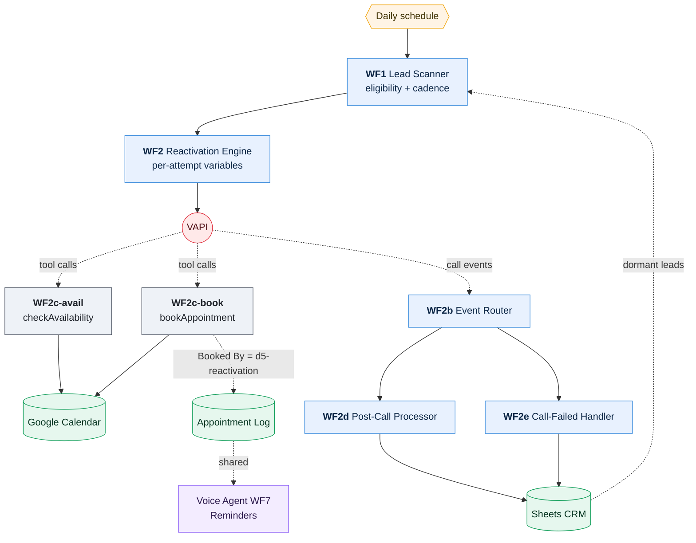
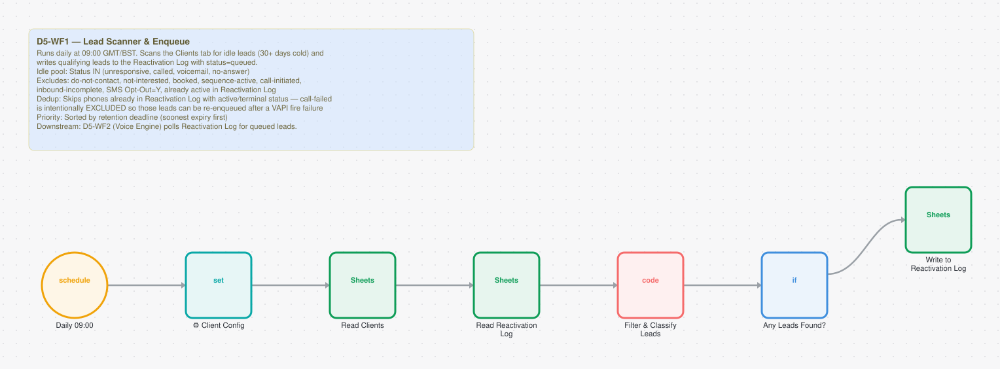
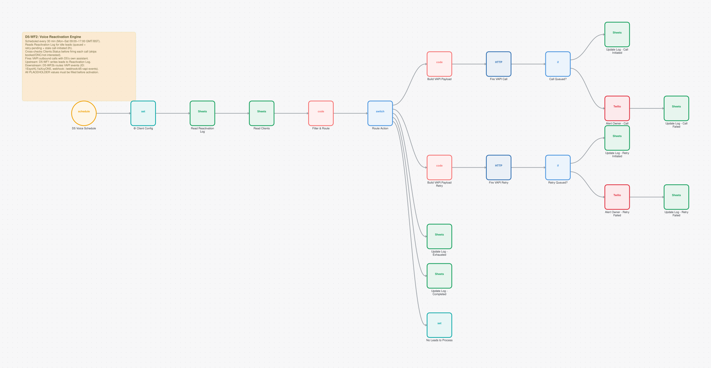
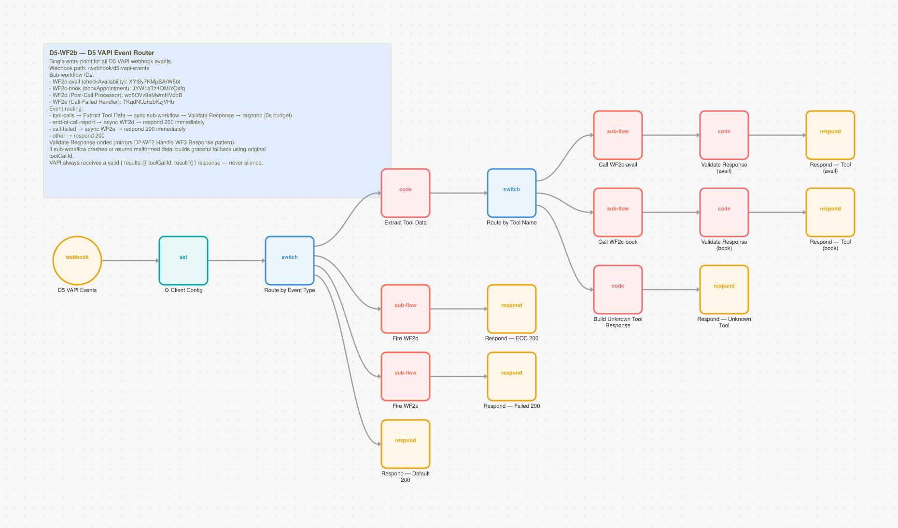
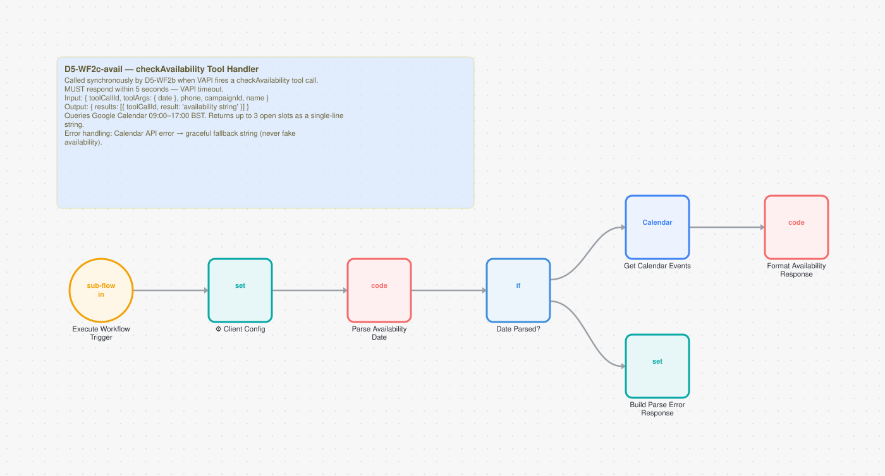
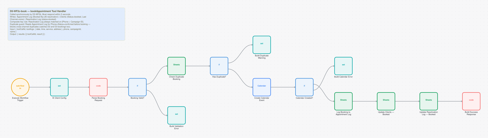
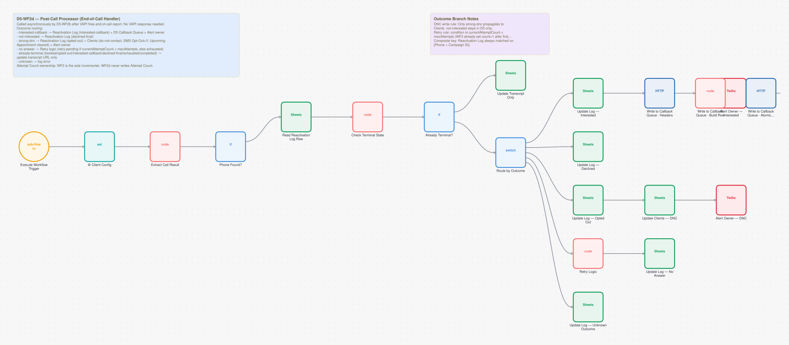
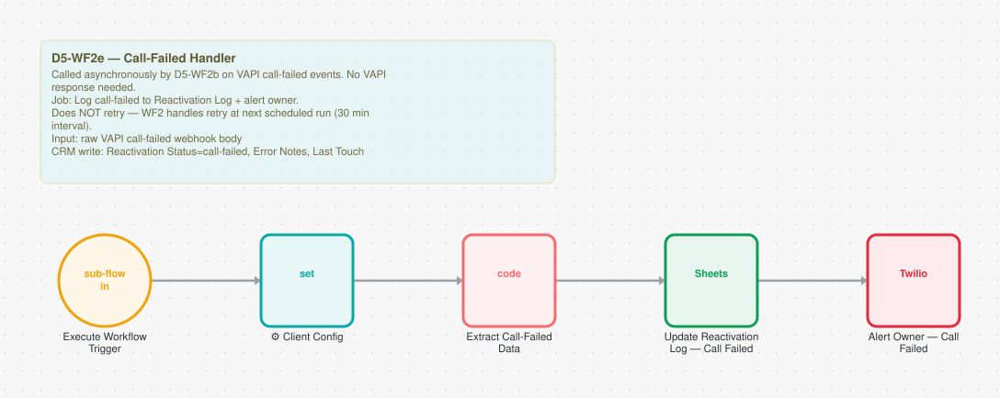

# Old Lead Reactivation

**7 workflows. 94 nodes. ~543 lines of JavaScript.**

Every installer is sitting on hundreds of dead leads: quoted once, never closed, never followed up. This system scans that database on a schedule and runs AI voice campaigns against it, with cadence control per attempt and strict opt-out handling.

It reuses the voice agent's booking dispatcher instead of reimplementing it, so a reactivated lead books into the same calendar through the same code path as a fresh one.

---

## How it fits together



The loop closes through the CRM. The scanner reads dormant leads, the engine calls them, the post-call processors write the outcomes back, and tomorrow's scan reads those outcomes to work out who is still eligible. Cadence lives in the CRM, not in workflow state.

The edge worth noticing is the bottom one. Reactivation bookings get tagged `Booked By = d5-reactivation` and land in the same appointment log as voice agent bookings, so the voice agent's reminder workflow picks them up without knowing this system exists.

---

## The workflows

| # | Workflow | Nodes | Trigger | Does |
|---|---|---:|---|---|
| 1 | [WF1 · Lead Scanner & Enqueue](#wf1--lead-scanner--enqueue) | 7 | Scheduled (cron) | Finds eligible dormant leads daily |
| 2 | [WF2 · Voice Reactivation Engine](#wf2--voice-reactivation-engine) | 21 | Scheduled (cron) | Places the call with per-attempt context |
| 3 | [WF2b · VAPI Event Router](#wf2b--vapi-event-router) | 18 | `POST /d5-vapi-events`, authenticated | Routes events to the four handlers |
| 4 | [WF2c-avail · checkAvailability](#wf2c-avail--checkavailability) | 7 | Called by another workflow | Availability tool for the campaign assistant |
| 5 | [WF2c-book · bookAppointment](#wf2c-book--bookappointment) | 15 | Called by another workflow | Books, tagged by campaign |
| 6 | [WF2d · Post-Call Processor](#wf2d--post-call-processor) | 21 | Called by another workflow | Branches on outcome |
| 7 | [WF2e · Call-Failed Handler](#wf2e--call-failed-handler) | 5 | Called by another workflow | Handles calls that never connected |

---

### WF1 · Lead Scanner & Enqueue

Runs daily, reads the CRM, and works out who is eligible for contact based on how long they have been dormant, how many attempts have already been made, and whether they have opted out.

Everything downstream depends on this filter being conservative. A false positive here means phoning someone who asked not to be contacted.



**7 nodes:** 3x `googleSheets`, 1x `scheduleTrigger`, 1x `set`, 1x `code`, 1x `if`  
**Trigger:** Scheduled (cron)  
**Code:** 90 lines of ES5 JavaScript  
**Export:** [`d5-wf01-lead-scanner.json`](../workflows/03-lead-reactivation/d5-wf01-lead-scanner.json)

<details><summary>Its on-canvas documentation</summary>

```
## D5-WF1 — Lead Scanner & Enqueue

Runs daily at 09:00 GMT/BST. Scans the Clients tab for idle leads (30+ days cold) and writes qualifying leads to the Reactivation Log with status=queued.

**Idle pool:** Status IN (unresponsive, called, voicemail, no-answer)
**Excludes:** do-not-contact, not-interested, booked, sequence-active, call-initiated, inbound-incomplete, SMS Opt-Out=Y, already active in Reactivation Log
**Dedup:** Skips phones already in Reactivation Log with active/terminal status — call-failed is intentionally EXCLUDED so those leads can be re-enqueued after a VAPI fire failure
**Priority:** Sorted by retention deadline (soonest expiry first)

Downstream: D5-WF2 (Voice Engine) polls Reactivation Log for queued leads.
```
</details>


### WF2 · Voice Reactivation Engine

Places the call, passing per-attempt variables into the assistant so a third attempt doesn't open with the same script as the first. Campaign type (a promotion, a seasonal offer, a subsidy update) is passed the same way, which is how one assistant covers many campaigns.



**21 nodes:** 8x `googleSheets`, 3x `code`, 2x `set`, 2x `httpRequest`, 2x `if`, 2x `twilio`  
**Trigger:** Scheduled (cron)  
**Code:** 130 lines of ES5 JavaScript  
**Export:** [`d5-wf02-voice-reactivation-engine.json`](../workflows/03-lead-reactivation/d5-wf02-voice-reactivation-engine.json)

<details><summary>Its on-canvas documentation</summary>

```
## D5-WF2: Voice Reactivation Engine

Scheduled every 30 min (Mon–Sat 09:00–17:00 GMT/BST).

Reads Reactivation Log for idle leads (queued + retry-pending + stale call-initiated >2h).
Cross-checks Clients.Status before firing each call (skips booked/DNC/not-interested).
Fires VAPI outbound calls with D5’s own assistant.

Upstream: D5-WF1 writes leads to Reactivation Log.
Downstream: D5-WF2b routes VAPI events (ID: 1EsyoHL1IaXcyON5, webhook: /webhook/d5-vapi-events).

All PLACEHOLDER values must be filled before activation.
```
</details>


### WF2b · VAPI Event Router

A thin router, and the only authenticated webhook in this system. It fans call lifecycle events out to the two tool workflows and the two post-call processors.



**18 nodes:** 6x `respondToWebhook`, 4x `code`, 4x `executeWorkflow`, 2x `switch`, 1x `webhook`, 1x `set`  
**Trigger:** `POST /d5-vapi-events`, authenticated  
**Code:** 59 lines of ES5 JavaScript  
**Export:** [`d5-wf02b-vapi-event-router.json`](../workflows/03-lead-reactivation/d5-wf02b-vapi-event-router.json)

<details><summary>Its on-canvas documentation</summary>

```
## D5-WF2b — D5 VAPI Event Router

Single entry point for all D5 VAPI webhook events.
Webhook path: **/webhook/d5-vapi-events**

**Sub-workflow IDs:**
- WF2c-avail (checkAvailability): XYt8y7KMpSArW5bt
- WF2c-book (bookAppointment): JYW1eTz4OMiYQxfq
- WF2d (Post-Call Processor): wd6OVv9aMwmHVddB
- WF2e (Call-Failed Handler): TKqdNUzhzbKzjVHb

**Event routing:**
- tool-calls → Extract Tool Data → sync sub-workflow → Validate Response → respond (5s budget)
- end-of-call-report → async WF2d → respond 200 immediately
- call-failed → async WF2e → respond 200 immediately
- other → respond 200

**Validate Response nodes (mirrors D2-WF2 Handle WF3 Response pattern):**
If sub-workflow crashes or returns malformed data, builds graceful fallback using original toolCallId.
VAPI always receives a valid { results: [{ toolCallId, result }] } response — never silence.
```
</details>


### WF2c-avail · checkAvailability

The availability tool for this assistant. Structurally the same idea as the voice agent's and the chatbot's versions. It is the third implementation of one concept, which is the honest cost of running three assistants that need slightly different context.



**7 nodes:** 2x `set`, 2x `code`, 1x `executeWorkflowTrigger`, 1x `if`, 1x `googleCalendar`  
**Trigger:** Called by another workflow  
**Code:** 103 lines of ES5 JavaScript  
**Export:** [`d5-wf02c-avail-check-availability.json`](../workflows/03-lead-reactivation/d5-wf02c-avail-check-availability.json)

<details><summary>Its on-canvas documentation</summary>

```
## D5-WF2c-avail — checkAvailability Tool Handler

Called **synchronously** by D5-WF2b when VAPI fires a checkAvailability tool call.
**MUST respond within 5 seconds — VAPI timeout.**

**Input:** { toolCallId, toolArgs: { date }, phone, campaignId, name }
**Output:** { results: [{ toolCallId, result: 'availability string' }] }

Queries Google Calendar 09:00–17:00 BST. Returns up to 3 open slots as a single-line string.
**Error handling:** Calendar API error → graceful fallback string (never fake availability).
```
</details>


### WF2c-book · bookAppointment

Books against a composite key of phone number and campaign ID, so the same lead can be booked across different campaigns without colliding, and writes `Booked By = d5-reactivation` for attribution.



**15 nodes:** 4x `set`, 4x `googleSheets`, 3x `if`, 2x `code`, 1x `executeWorkflowTrigger`, 1x `googleCalendar`  
**Trigger:** Called by another workflow  
**Code:** 68 lines of ES5 JavaScript  
**Export:** [`d5-wf02c-book-appointment.json`](../workflows/03-lead-reactivation/d5-wf02c-book-appointment.json)

<details><summary>Its on-canvas documentation</summary>

```
## D5-WF2c-book — bookAppointment Tool Handler

Called **synchronously** by D5-WF2b. Must respond within 5 seconds.

**Writes:** Appointment Log (Booked By=d5-reactivation) | Clients (Status=booked, Last Channel=voice) | Reactivation Log (status=booked)

**Composite key rule:** Reactivation Log always matched on [Phone + Campaign ID].
**Duplicate guard:** Reads Appointment Log for Phone+Status=confirmed before booking — blocks cross-channel duplicates (catches D2 and D3 bookings too).

**Input:** { toolCallId, toolArgs: { date, time, service, address }, phone, campaignId, name }
**Output:** { results: [{ toolCallId, result }] }
```
</details>


### WF2d · Post-Call Processor

Reads the outcome and branches four ways: interested with a callback request, not interested, a firm do-not-contact, or no answer. Each writes different CRM state, and that state is what tomorrow's scanner reads to decide whether this lead gets contacted again.



**21 nodes:** 8x `googleSheets`, 4x `code`, 2x `if`, 2x `twilio`, 2x `httpRequest`, 1x `executeWorkflowTrigger`  
**Trigger:** Called by another workflow  
**Code:** 80 lines of ES5 JavaScript  
**Export:** [`d5-wf02d-post-call-processor.json`](../workflows/03-lead-reactivation/d5-wf02d-post-call-processor.json)

<details><summary>Its on-canvas documentation</summary>

```
## D5-WF2d — Post-Call Processor (End-of-Call Handler)

Called **asynchronously** by D5-WF2b after VAPI fires end-of-call-report. No VAPI response needed.

**Outcome routing:**
- interested-callback → Reactivation Log (interested-callback) + D5 Callback Queue + Alert owner
- not-interested → Reactivation Log (declined-final)
- strong-dnc → Reactivation Log (opted-out) + Clients (do-not-contact, SMS Opt-Out=Y, Upcoming Appointment cleared) + Alert owner
- no-answer → Retry logic (retry-pending if currentAttemptCount < maxAttempts, else exhausted)
- already-terminal (booked/opted-out/interested-callback/declined-final/exhausted/completed) → update transcript URL only
- unknown → log error

**Attempt Count ownership:** WF2 is the sole incrementer. WF2d never writes Attempt Count.
```
</details>


### WF2e · Call-Failed Handler

Keeps "the call failed to connect" separate from "the call happened and went badly". Merging those two corrupts the cadence logic, because a network failure is not a signal from the customer and shouldn't count as an attempt the same way.



**5 nodes:** 1x `executeWorkflowTrigger`, 1x `set`, 1x `code`, 1x `googleSheets`, 1x `twilio`  
**Trigger:** Called by another workflow  
**Code:** 13 lines of ES5 JavaScript  
**Export:** [`d5-wf02e-call-failed-handler.json`](../workflows/03-lead-reactivation/d5-wf02e-call-failed-handler.json)

<details><summary>Its on-canvas documentation</summary>

```
## D5-WF2e — Call-Failed Handler

Called **asynchronously** by D5-WF2b on VAPI call-failed events. No VAPI response needed.

**Job:** Log call-failed to Reactivation Log + alert owner.
**Does NOT retry** — WF2 handles retry at next scheduled run (30 min interval).

**Input:** raw VAPI call-failed webhook body
**CRM write:** Reactivation Status=call-failed, Error Notes, Last Touch
```
</details>


---

## Engineering notes

**Consent is the hard constraint.** UK PECR governs unsolicited marketing calls. Opting out sets do-not-contact across the CRM and every campaign checks it before dialling.

That is why a formatting bug counted as a compliance problem. The opt-out check is an exact phone-string match, and 36 Sheets writes were using `cellFormat: RAW`, which can turn a phone number into a numeric value and drop the leading `+`. A reformatted number stops matching its own opt-out record.

**Four critical bugs came out of one audit pass**, all with the same root cause: Code nodes reading `$input` after a config Set node, and config nodes missing `includeOtherFields`. Before the fix, both booking tools returned validation errors permanently, post-call processing ran on empty fields, and the call-failed handler wrote garbage rows. Nothing in this system worked, and it validated clean. See [Class 5](../engineering/bug-taxonomy.md).

**Reuse across systems is deliberate.** Because bookings land in the shared appointment log, reminders, cancellation and rescheduling all work for reactivation bookings without a line of reactivation-specific code.

---

## Run it

Import any of the JSON exports from [`workflows/03-lead-reactivation/`](../workflows/03-lead-reactivation/). Credentials are stubbed as `CREDENTIAL_ID` and account identifiers as `YOUR_*` placeholders, so you will need to re-map them after import.
