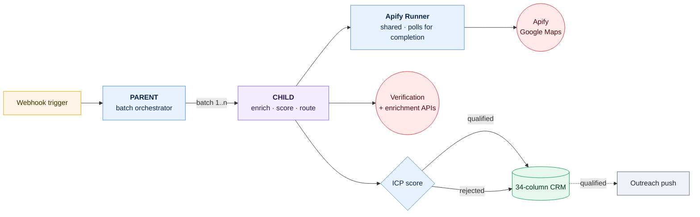
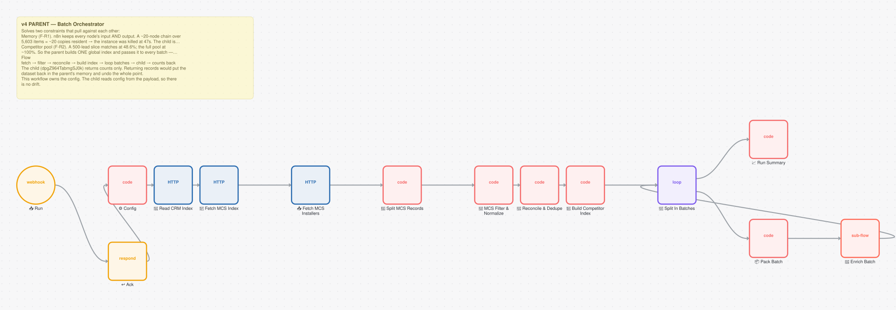
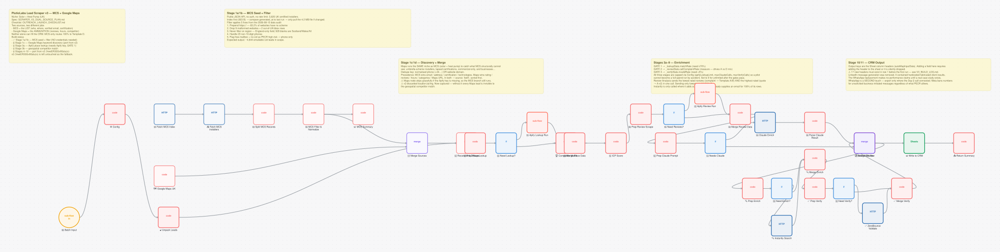
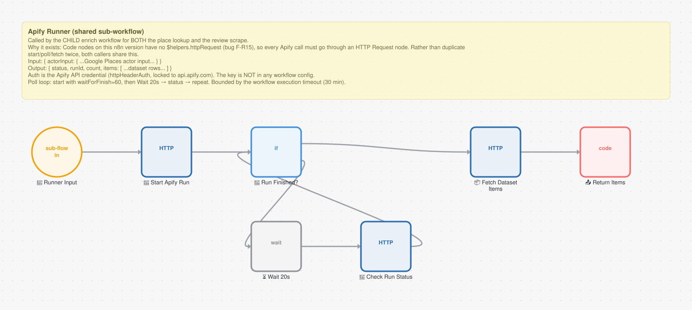

# B2B Lead Scraper v4

**3 workflows · 58 nodes · ~2595 lines of JavaScript**

A parent/child batch pipeline that discovers, enriches, scores and routes B2B prospects into a 34-column CRM. The parent orchestrates batches; the child does the heavy enrichment per batch — which bounds memory and makes partial failure recoverable.

These three workflows are active on the live instance and this is the pipeline that has run most consistently in real use.

---

## How it fits together



**Parent/child exists for memory and recoverability.** A single-workflow version held every prospect in memory and failed on large runs. Batching bounds memory, and a failed batch is retried alone instead of restarting the whole run.

The Apify runner is factored out and shared because actor runs are *asynchronous* — they can take minutes. It starts the run and polls for completion rather than holding a blocking HTTP request open past the gateway timeout.

---

## The workflows

| # | Workflow | Nodes | Trigger | Does |
|---|---|---:|---|---|
| 1 | [Scraper v4 · PARENT](#scraper-v4--parent) | 14 | `POST /scraper-v4-run` · **unauthenticated** | Splits a run into batches |
| 2 | [Scraper v4 · CHILD](#scraper-v4--child) | 37 | Called by another workflow | Enrichment, scoring, routing, CRM write |
| 3 | [Apify Runner (shared)](#apify-runner-shared) | 7 | Called by another workflow | Starts an actor run and polls it |

---

### Scraper v4 · PARENT

Takes a run request, splits it into batches, and invokes the child once per batch. Keeping orchestration separate from processing means the expensive part can fail and be retried without re-running discovery.



**14 nodes** — 7× `code` · 3× `httpRequest` · 1× `webhook` · 1× `respondToWebhook` · 1× `splitInBatches` · 1× `executeWorkflow`  
**Trigger** — `POST /scraper-v4-run` · **unauthenticated**  
**Code** — 656 lines of ES5 JavaScript  
**Export** — [`scraper-v4-parent-orchestrator.json`](../workflows/04-lead-scraper/scraper-v4-parent-orchestrator.json)

> This webhook is **unauthenticated**. It triggers paid Apify actor runs, so an unauthenticated caller can spend money. Lower severity than the voice-agent endpoint — it cannot contact customers — but a known gap.

<details><summary>Its on-canvas documentation</summary>

```
## v4 PARENT — Batch Orchestrator

Solves two constraints that pull against each other:

**Memory (F-R1).** n8n keeps every node's input AND output. A ~20-node chain over 5,603 items = ~20 copies resident → the instance was killed at 47s. The child is a separate execution, so its memory is freed after every batch.

**Competitor pool (F-R2).** A 500-lead slice matches at 48.6%; the full pool at ~100%. So the parent builds ONE global index and passes it to every batch — batches never match against just themselves.

### Flow
fetch → filter → reconcile → build index → loop batches → child → counts back

The child (`dpgZ964TabmgSJ0k`) returns **counts only**. Returning records would put the dataset back in the parent's memory and undo the whole point.

**This workflow owns the config.** The child reads config from the payload, so there is no drift.
```
</details>


### Scraper v4 · CHILD

The pipeline core, and the largest single workflow outside the voice agent's dispatcher. Per batch it enriches raw scrape results, verifies contact details, scores each prospect against the ICP definition, decides a routing outcome, and writes to the CRM.

With 34 columns, positional writes are fragile — inserting one column silently shifts every subsequent field. Writes read the live header row and map by column name.



**37 nodes** — 21× `code` · 5× `httpRequest` · 5× `if` · 2× `merge` · 2× `executeWorkflow` · 1× `googleSheets`  
**Trigger** — Called by another workflow  
**Code** — 1915 lines of ES5 JavaScript  
**Export** — [`scraper-v4-child-enrich.json`](../workflows/04-lead-scraper/scraper-v4-child-enrich.json)

<details><summary>Its on-canvas documentation</summary>

```
## PlutioLabs Lead Scraper v3 — MCS + Google Maps

**Niche:** Solar + Heat Pump (UK)
**Spec:** SCRAPER_V3_DUAL_SOURCE_PLAN.md
**Checklist:** OUTREACH_LAUNCH_CHECKLIST.md

### Two sources, two different jobs
- **MCS** = the LIST (who, where, verified email, certification)
- **Google Maps** = the AMMUNITION (reviews, hours, competitor)

Neither alone can fill the CRM. MCS-only routes 100% to Template D.

### Build status
- ✅ Stage 1a/1b — MCS seed + filter (NO credentials needed)
- ⏳ Stage 1c — Google Maps keyword discovery (port from v2)
- ⏳ Stage 3a — Apify place lookup (needs Apify key, GATE 1)
- ⏳ Stage 3b — geospatial competitor match
- ⏳ Stages 4–10 — port from v2 (VweER3SSx9Saluzx)

**v2 (VweER3SSx9Saluzx) is left untouched as the fallback.**
```
</details>


### Apify Runner (shared)

A small shared workflow that starts an Apify actor run and polls until it completes. Factored out because both discovery paths need it and because async-run polling is the kind of logic you want implemented exactly once.



**7 nodes** — 3× `httpRequest` · 1× `executeWorkflowTrigger` · 1× `if` · 1× `wait` · 1× `code`  
**Trigger** — Called by another workflow  
**Code** — 24 lines of ES5 JavaScript  
**Export** — [`apify-runner-shared.json`](../workflows/04-lead-scraper/apify-runner-shared.json)

<details><summary>Its on-canvas documentation</summary>

```
## Apify Runner (shared sub-workflow)

Called by the CHILD enrich workflow for BOTH the place lookup and the review scrape.

**Why it exists:** Code nodes on this n8n version have no `$helpers.httpRequest` (bug F-R15), so every Apify call must go through an HTTP Request node. Rather than duplicate start/poll/fetch twice, both callers share this.

**Input:** `{ actorInput: { ...Google Places actor input... } }`
**Output:** `{ status, runId, count, items: [ ...dataset rows... ] }`

Auth is the **Apify API** credential (httpHeaderAuth, locked to api.apify.com). The key is NOT in any workflow config.

Poll loop: start with `waitForFinish=60`, then Wait 20s → status → repeat. Bounded by the workflow execution timeout (30 min).
```
</details>


---

## Engineering notes

**This is the operationally busiest system**, which is why it has ten maintenance workflows attached to it — see below. That is the honest shape of a spreadsheet-backed CRM written to concurrently by five systems: the automation needs its own maintenance automation.

A dedicated database would remove most of them. That trade-off was made deliberately in favour of a store the client can open and read.

### CRM utilities

| Utility | Purpose |
|---|---|
| CRM Audit | Full sweep of record health |
| CRM Integrity Check | Schema and referential integrity |
| Dedupe CRM | Duplicate detection and merge |
| CRM Status | Status distribution snapshot |
| Routing Audit | Verifies routing against ICP rules |
| Route Recompute | Backfills routing after a rule change |
| Contact Quality | Scores completeness and deliverability |
| Add Row Key + Size Tier | Backfills keys and size tiers |
| Write CRM Headers | Repairs the header row |
| CRM to Instantly Push | Pushes qualified leads to outreach |

Several exist *because of* defects — the header repair, the deduper, and the route backfill all clean up after something that went wrong earlier. All ten webhooks are unauthenticated; they are internal tools on an obscure host, which is an explanation rather than a defence.

Exports: [`workflows/06-utilities/`](../workflows/06-utilities/)

---

## Run it

Import any of the JSON exports from [`workflows/04-lead-scraper/`](../workflows/04-lead-scraper/). Credentials are stubbed as `CREDENTIAL_ID` and account identifiers as `YOUR_*` placeholders; re-map them after import.
