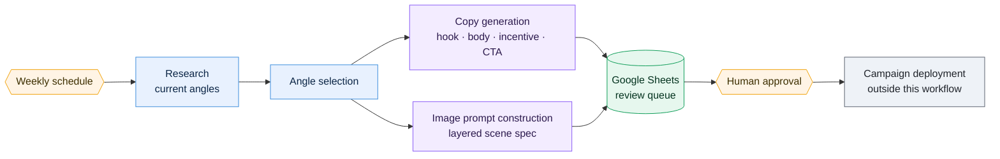
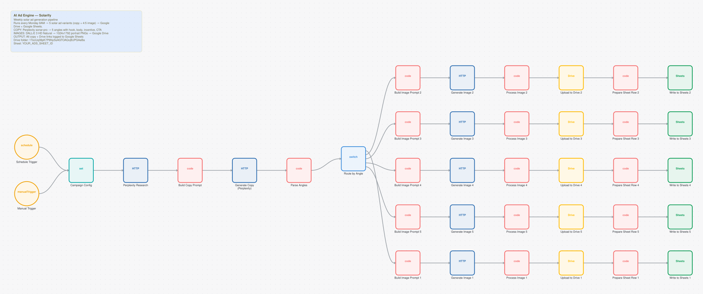

# AI Ad Engine

**1 workflows. 38 nodes. ~283 lines of JavaScript.**

A weekly batch that researches current market angles, writes ad copy variants (hook, body, incentive, CTA), builds structured image prompts, and drops everything into Google Sheets for review.

It is a review queue, not an auto-publisher. No creative reaches a live campaign without a person approving it.

---

## How it fits together



The human gate is the design rather than a limitation. Ad spend is irreversible and brand damage is expensive, so the pipeline produces a queue of candidates. Generation is automated. The decision isn't.

---

## The workflows

| # | Workflow | Nodes | Trigger | Does |
|---|---|---:|---|---|
| 1 | [Weekly Batch](#weekly-batch) | 38 | Scheduled (cron) | Research → copy + image prompts → Sheets |

---

### Weekly Batch

A single 38-node scheduled workflow: research the landscape, pick angles, generate copy variants and layered image prompts, export the batch to Sheets for review.

It is the oldest workflow in the repository, built on 7 March 2026, and it shows. It predates every convention in [`build-standards.md`](../engineering/build-standards.md). It is included partly as a baseline, because the gap between this and the voice agent's dispatcher is the clearest measure of what eight months of audit passes actually changed.



**38 nodes:** 17x `code`, 7x `httpRequest`, 5x `googleDrive`, 5x `googleSheets`, 1x `scheduleTrigger`, 1x `manualTrigger`  
**Trigger:** Scheduled (cron)  
**Code:** 283 lines of ES5 JavaScript  
**Export:** [`ad-engine-weekly-batch.json`](../workflows/05-ad-engine/ad-engine-weekly-batch.json)

> While sanitizing this repository for publication, this workflow turned out to contain two live API keys hardcoded in plaintext in a Set node: an OpenAI project key and a Perplexity key. That is exactly the mistake the "no credentials in node parameters" rule exists to prevent. It is written up here rather than quietly cleaned up, because it makes two points worth making: secrets belong in a credential store, and sanitizing exports before publishing them is not optional. The JSON in this repo carries `*_REDACTED` placeholders.

<details><summary>Its on-canvas documentation</summary>

```
## AI Ad Engine — Solarify
**Weekly solar ad generation pipeline**

Runs every Monday 8AM → 5 solar ad variants (copy + 4:5 image) → Google Drive + Google Sheets.

**COPY:** Perplexity sonar-pro → 5 angles with hook, body, incentive, CTA
**IMAGES:** DALL-E 3 HD Natural → 1024x1792 portrait PNGs → Google Drive
**OUTPUT:** All copy + Drive links logged to Google Sheets

**Drive folder:** 1TocUq38pK7P6NySsAGTOAQvj8UPGAeBa
**Sheet:** YOUR_ADS_SHEET_ID
```
</details>


---

## Engineering notes

**Included on purpose, flaws and all.** A portfolio containing only the good work tells you less than one that shows a starting point and a direction. This is what the project looked like before the build standards existed. The voice agent is what it looked like after.

**The human gate is a product decision.** Generation is cheap and reversible. Ad spend is neither.

---

## Run it

Import any of the JSON exports from [`workflows/05-ad-engine/`](../workflows/05-ad-engine/). Credentials are stubbed as `CREDENTIAL_ID` and account identifiers as `YOUR_*` placeholders, so you will need to re-map them after import.
