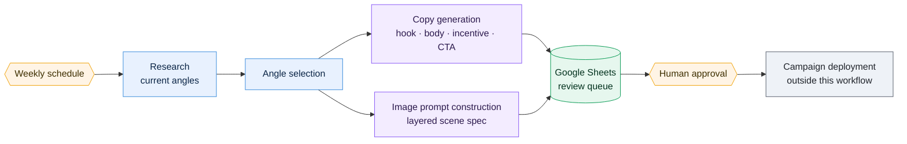

# AI Ad Engine

**1 workflows · 38 nodes · ~283 lines of JavaScript**

A weekly scheduled batch that researches current market angles, generates ad copy variants — hook, body, incentive, CTA — and builds structured image-generation prompts, exporting everything to Google Sheets for human review.

Deliberately a **review queue, not an auto-publisher**. No creative reaches a live campaign without a person approving it.

---

## How it fits together



The human gate is the design, not a limitation. Ad spend is irreversible and brand damage is expensive, so the pipeline's output is a *queue of candidates* — the generation is automated, the decision is not.

---

## The workflows

| # | Workflow | Nodes | Trigger | Does |
|---|---|---:|---|---|
| 1 | [Weekly Batch](#weekly-batch) | 38 | Scheduled (cron) | Research → copy + image prompts → Sheets |

---

### Weekly Batch

A single 38-node scheduled workflow: research the current landscape, select angles, generate copy variants and layered image prompts, and export the whole batch to Sheets for review.

It is the **oldest workflow in the repository** — 7 March 2026 — and it shows. It predates every convention in [`build-standards.md`](../engineering/build-standards.md), and it is included partly as a baseline: the contrast between this and the voice agent's dispatcher is the clearest available measure of what eight months of audit passes actually changed.


**38 nodes** — 17× `code` · 7× `httpRequest` · 5× `googleDrive` · 5× `googleSheets` · 1× `scheduleTrigger` · 1× `manualTrigger`  
**Trigger** — Scheduled (cron)  
**Code** — 283 lines of ES5 JavaScript  
**Export** — [`ad-engine-weekly-batch.json`](../workflows/05-ad-engine/ad-engine-weekly-batch.json)

> During sanitization of this repository, this workflow was found to contain **two live API keys hardcoded in plaintext inside a Set node** — an OpenAI project key and a Perplexity key. That is precisely the defect the 'no credentials in node parameters' rule exists to prevent. It is documented here rather than quietly cleaned up, because it demonstrates two things worth demonstrating: why secrets belong in a credential store, and why a sanitization pass before publishing any workflow export is mandatory. The exported JSON carries `*_REDACTED` placeholders.

<details><summary>Its on-canvas documentation</summary>

```
## AI Ad Engine — Solarify
**Weekly solar ad generation pipeline**

Runs every Monday 8AM → 5 solar ad variants (copy + 4:5 image) → Google Drive + Google Sheets.

**COPY:** Perplexity sonar-pro → 5 angles with hook, body, incentive, CTA
**IMAGES:** DALL-E 3 HD Natural → 1024x1792 portrait PNGs → Google Drive
**OUTPUT:** All copy + Drive links logged to Google Sheets

**Drive folder:** 1TocUq38pK7P6NySsAGTOAQvj8UPGAeBa
**Sheet:** YOUR_ADS_SHEET_ID
```
</details>


---

## Engineering notes

**Included deliberately, flaws and all.** A portfolio of only the best work tells a reviewer less than one that shows a starting point and a trajectory. This workflow is what the project looked like before the build standards existed; the voice agent is what it looked like after.

**The human gate is a product decision.** Generation is cheap and reversible; ad spend is neither.

---

## Run it

Import any of the JSON exports from [`workflows/05-ad-engine/`](../workflows/05-ad-engine/). Credentials are stubbed as `CREDENTIAL_ID` and account identifiers as `YOUR_*` placeholders; re-map them after import.
